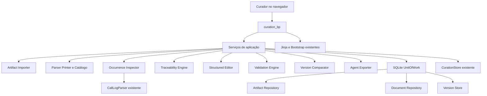
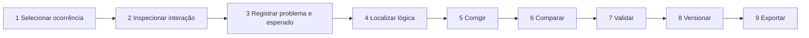
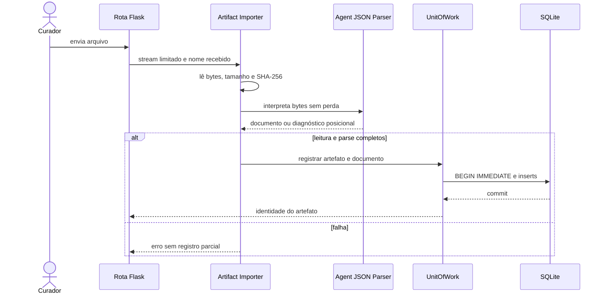

# Design Document: Agent Logic Curation

## Overview

### Propósito

A feature `agent-logic-curation` estende o dashboard Flask existente com um fluxo auditável para investigar uma ocorrência real, localizar a lógica do agente que influenciou o comportamento observado, propor uma correção em uma cópia de trabalho, comparar e validar a mudança, criar uma versão imutável e exportar o documento completo. O desenho prioriza quatro invariantes:

1. o `Original_Artifact` e suas informações de integridade nunca são modificados;
2. nenhuma afirmação sobre execução é apresentada como observada sem `Raw_Evidence` correspondente;
3. nenhuma decisão ambígua sobre fonte canônica ou responsabilidade é tomada por heurística silenciosa;
4. nenhuma exportação final ocorre sem validação vigente, completa, sem `Blocking_Error` e com todos os `Warning` reconhecidos.

A implementação futura será uma extensão do monólito modular já existente: a mesma app factory Flask, templates Jinja, Bootstrap, arquivo SQLite, `CurationStore`, `CallLogParser` e modelos de eventos. Não será criada uma segunda aplicação web, um segundo parser de logs ou um armazenamento paralelo para os relatórios legados.

### Escopo e limites

O desenho cobre ingestão local, interpretação JSON sem perda semântica, catálogo estrutural, resolução da fonte canônica, dependências, inspeção de logs, rastreabilidade, curadoria estruturada, edição, validação estática, comparação, histórico, exportação e proteção de dados sensíveis. Ele não cobre publicação no ambiente do agente, execução de `Action_Code`, invocação de Tools/endpoints, correção automática do arquivo original, autenticação corporativa específica ou definição inventada de um `Source_Schema`.

O `Source_Schema` é uma dependência local, versionada e identificada por `specVersion`. Quando não existir uma versão compatível, o sistema ainda poderá interpretar JSON e executar verificações sintáticas, estruturais, referenciais e estáticas independentes de schema, mas deverá criar um `Blocking_Error`, marcar a validação de schema como incompleta e bloquear versionamento/exportação final. O perfil Athena encontrado no workspace é evidência para casos de teste e para verificações de risco; ele não é promovido a schema autoritativo.

### Contexto existente e achados que orientam o desenho

- `dashboard.app.create_app(config=None)` já compõe rotas, templates e o `CurationStore`; a feature será registrada nessa factory por um Blueprint com prefixo `/curation`.
- `dashboard.store.CurationStore` e a tabela `curation_reports` continuam sendo a responsabilidade exclusiva dos relatórios textuais legados. Novos repositórios usam o mesmo arquivo SQLite, com tabelas aditivas e transações compartilhadas, sem reescrever registros existentes.
- `log_analyzer.apps.call_parser.CallLogParser` e seus modelos (`CallEvent`, `ConversationMessage`, `AIModelInfo`, `SessionSummary`, `AudioRepetition`, `CallData`) permanecem a fonte semântica para ocorrências. Um adaptador de proveniência acrescenta arquivo, linha, ordem de leitura e texto bruto sem duplicar as regras do parser.
- O artefato `OpsCloud-AthenaAdaStudio.json` contém representações normalizadas e gráficas potencialmente duplicadas, `promptText`, `allPrompts`, `drafts`, histórico, `nodeValidation`, JSON embutido em strings e `Action_Code`. Esses achados exigem preservar duplicatas, ordem, campos desconhecidos e proveniência, e proíbem escolher automaticamente a representação “mais recente”.
- O projeto já usa `pytest` e `hypothesis`; a lógica pura de parser/printer, ordenação, diff, edição, validação, versionamento e exportação é adequada a testes baseados em propriedades.

### Pesquisa técnica incorporada

- A documentação oficial de [`json` do Python](https://docs.python.org/3/library/json.html) confirma que `object_pairs_hook` recebe pares na ordem de leitura e que `parse_int`/`parse_float` recebem o lexema numérico. O desenho usa esses pontos apenas como apoio e acrescenta um scanner posicional próprio, pois um `dict` comum perderia ocorrências de chaves duplicadas e offsets.
- A documentação oficial de [`ast` do Python](https://docs.python.org/3/library/ast.html) descreve `ast.parse()` como construção de árvore sintática. A validação de `Action_Code` usa somente parse e visitantes estáticos; nunca usa `exec`, `eval`, importação dinâmica ou chamadas.
- A documentação de [atomicidade do SQLite](https://sqlite.org/atomiccommit.html) e de [foreign keys](https://www.sqlite.org/foreignkeys.html) fundamenta uma única unidade transacional por comando persistente e `PRAGMA foreign_keys = ON` em toda conexão.
- O padrão oficial de [uploads do Flask](https://flask.palletsprojects.com/en/stable/patterns/fileuploads/) fundamenta limite de corpo, leitura controlada e rejeição de nomes/caminhos fornecidos como destino confiável.
- A documentação de [Blueprints do Flask](https://flask.palletsprojects.com/en/stable/blueprints/) fundamenta o registro do módulo na app factory existente, compartilhando configuração e serviços em vez de criar uma aplicação paralela.

Conteúdo das fontes externas foi parafraseado para conformidade com restrições de licenciamento.

### Decisões principais e alternativas rejeitadas

| Decisão | Racional | Alternativa rejeitada |
|---|---|---|
| Blueprint `curation_bp` registrado por `create_app` | Reutiliza ciclo de vida, configuração, templates e tratamento de erro atuais | Nova aplicação Flask ou microserviço, por duplicar arquitetura e estado |
| Bytes originais em `BLOB` imutável no SQLite | A identidade pode ser recalculada sem depender de arquivo externo mutável | Guardar somente caminho do upload |
| Árvore JSON ordenada com membros por ocorrência | Preserva duplicatas, tipos, lexemas numéricos e ordem | `json.loads()` para `dict` |
| `Source_Path` canônico inclui ocorrência de membro e distingue chave de valor | Garante unicidade mesmo com chaves duplicadas | JSON Pointer puro, que não distingue ocorrências duplicadas |
| Classificação canônica somente por regras do schema e confirmação auditada | Evita escolher versão errada por posição/data | “Último campo vence” ou candidato mais recente |
| `CallLogParser` envolvido por adaptador de evidência | Mantém uma única semântica de parsing e adiciona proveniência ausente | Segundo parser concorrente |
| `ast.parse` e visitantes sem execução | Atende análise de risco sem efeitos colaterais | Sandbox de execução, que ainda violaria a proibição de executar código importado |
| SQLite único com repositórios especializados e `UnitOfWork` | Permite atomicidade entre versão, curadoria e auditoria | Bancos separados ou commits independentes |
| Exportação sem mudanças retorna o `BLOB` original | Única forma de garantir identidade byte a byte | Reformatar um documento semanticamente igual |
| Mascaramento somente na projeção de apresentação | Preserva evidência e exportação originais | Sobrescrever valores persistidos com máscara |

## Architecture

### Estilo arquitetural e fronteiras

A feature segue um monólito modular em quatro camadas:

1. **Apresentação:** Blueprint Flask, formulários HTTP, Jinja e componentes Bootstrap; não contém regras de domínio.
2. **Aplicação:** serviços de caso de uso coordenam autorização, estado das nove etapas, transações e respostas Post/Redirect/Get.
3. **Domínio:** parser/printer, catálogo, resolvedor canônico, rastreabilidade, editores, comparador, validação e política sensível são funções ou serviços independentes de Flask e SQLite sempre que possível.
4. **Infraestrutura:** repositórios SQLite, adaptador do `CallLogParser`, leitor local de arquivos, relógio, gerador de identificadores e registro do `Actor`.



`CurationStore` continua fora do `UnitOfWork` das novas tabelas para operações legadas isoladas. Quando um comando novo apenas referencia um `curation_report`, ele lê o relatório pelo store existente e persiste somente o vínculo novo na transação da feature; nunca atualiza o relatório como efeito colateral. Operações legadas continuam seguindo as rotas e contratos atuais.

### Fluxo guiado do usuário

A sessão mantém uma máquina de estados persistida. Uma etapa só pode ser concluída quando suas pré-condições declaradas estão satisfeitas; retornar a uma etapa não elimina alterações da `Work_Copy` nem conclusões válidas. Dependências posteriores são calculadas, não habilitadas por estado de tela efêmero.



Cada página apresenta termos em português, estado da etapa, campos faltantes e o próximo passo. O fallback JSON existe somente dentro do `Source_Path` selecionado e não é necessário para concluir o fluxo quando há editor tipado. Descarte usa uma intenção persistida de curta duração contendo revisão da cópia e conjunto exato de caminhos; a confirmação falha sem mutação se a revisão tiver mudado desde a solicitação.

### Fluxo de ingestão e reabertura



O upload é lido uma única vez para área temporária controlada ou memória limitada, calculando SHA-256 incrementalmente. `MAX_CONTENT_LENGTH` e um limite adicional configurável impedem consumo ilimitado. O nome recebido é armazenado como dado, nunca usado para construir caminho. Antes do commit, a leitura precisa estar completa, o tamanho conferido e o JSON convertido em `Agent_Document`; qualquer falha descarta o staging.

A reabertura lê o `BLOB` registrado em transação de leitura, recalcula tamanho e SHA-256 sobre todos os bytes e só materializa o documento se ambos coincidirem. Divergência ou falha de leitura produz resultado de integridade falho, não cria cópia e não atualiza nenhuma entidade. As tabelas e triggers rejeitam `UPDATE`/`DELETE` do original como defesa adicional.

### Interpretação JSON sem perda e `Source_Path`

O parser usa uma representação própria, não um mapa de linguagem:

- objeto é uma lista ordenada de `JsonMember`;
- cada `JsonMember` retém chave, ordinal entre chaves iguais, spans/lexemas e nó de valor;
- array é uma lista ordenada de nós;
- número retém categoria JSON e lexema original, sem conversão obrigatória para `float`;
- string retém valor decodificado e lexema/spans originais;
- `null` e boolean mantêm tipos distintos;
- trivia e offsets mapeiam caracteres para bytes, permitindo diagnóstico em offset de byte;
- campos desconhecidos permanecem nós normais;
- JSON embutido declarado pelo schema mantém a string externa e uma visão filha separada, nunca substitutiva.

O formato canônico de `Source_Path` é derivado apenas da estrutura e da ordem lida:

- `$` identifica o valor raiz;
- `/member/<chave-percent-encoded>/<ordinal>/key` identifica uma ocorrência de chave de objeto;
- `/member/<chave-percent-encoded>/<ordinal>/value` identifica seu valor;
- `/index/<n>` identifica o valor de um elemento de array.

A chave é codificada como bytes UTF-8 por percent-encoding canônico, com hexadecimais maiúsculos; o ordinal é iniciado em zero entre membros de mesmo nome e o índice é iniciado em zero. Exemplo: `$/member/flows/0/value/index/1/member/name/0/value`. Assim, chave e valor recebem caminhos distintos, duplicatas não colidem e os mesmos bytes geram os mesmos caminhos. Um `Node_Id` interno preserva a linhagem entre snapshots; `Source_Path` continua sendo a posição observável de cada snapshot. Inserções e remoções recalculam caminhos posicionais e o comparador usa linhagem mais sequência ordenada para não confundir deslocamento com alteração de valor.

O printer determinístico percorre essa árvore ordenada, usa uma unidade fixa de indentação configurada pela aplicação e emite lexemas numéricos preservados. Para um documento não alterado destinado à exportação, o printer é ignorado e os bytes originais são retornados. Para documento alterado, o printer emite JSON válido a partir da árvore efetiva, preservando todos os nós fora do `Change_Set` e a ordem relativa dos membros; whitespace fora de caminhos alterados não é prometido. Uma validação parse-after-print antecede qualquer disponibilização.

### Catálogo, fonte canônica e grafo

`StructureCatalogBuilder` percorre toda a árvore sem deduplicar ocorrências. Ele produz `LogicElement`, relações pai-filho, referências resolvidas/não resolvidas, categorias e contagens por `Source_Path`. Valores estruturados e texto bruto são projeções irmãs do mesmo elemento. Campos esperados ausentes são nós de catálogo diagnósticos, sem valor sintético.

`CanonicalSourceResolver` recebe o catálogo e um `SourceSchemaDescriptor`. Cada candidato recebe exatamente uma classificação. Somente marcadores/referências definidos no schema podem produzir `Published_Source`, `Draft_Source` ou `Historical_Source`; ausência, empate ou combinação não definida produz `Unresolved_Source`. A confirmação do curador exige um candidato, justificativa não vazia e `Actor` conhecido, e persiste decisão e auditoria fora do documento.

O grafo direcionado mantém arestas de referências explícitas. Arestas não resolvidas retêm origem e identificador de destino. Uma comparação de duplicatas agrupa representações apenas quando o schema ou uma referência explícita declara que representam a mesma configuração; valores distintos geram finding e nunca são reconciliados automaticamente.

### Ocorrência e rastreabilidade

O `LogEvidenceAdapter` fornece ao `CallLogParser` as fontes configuradas e, em paralelo, captura para cada linha: arquivo lógico, número iniciado em 1, ordem global de leitura e texto exato. O `CallLogParser` continua determinando quais registros e modelos pertencem ao CallId. O adaptador apenas associa proveniência aos resultados e preserva linhas não interpretadas que pertencem ao CallId como `Raw_Evidence` com `Evidence_Gap`; ele não cria eventos semânticos concorrentes.

Eventos com timestamp válido são ordenados por `(timestamp, read_order)`. Eventos sem timestamp válido vêm depois, por `read_order`, e carregam lacuna explícita. Requests/responses e chamadas de Tool só são agrupadas quando os identificadores/relações observados pelo parser sustentam o vínculo. Fonte inacessível gera lacuna de fonte, sem declarar ausentes dados que não puderam ser examinados.

O `TraceabilityEngine` usa índices exatos por categoria, tipo e valor. A correspondência retorna zero, um ou vários candidatos; somente confirmação explícita transforma um link ambíguo em confirmado. A navegação bidirecional fica disponível para candidato único, mas a atribuição causal em `Curation_Record` exige confirmação registrada. Transformações são cadeias de valores observados; qualquer salto sem evidência recebe lacuna, nunca um valor inferido.

### Edição, comparação, validação e exportação

A `Work_Copy` é um overlay isolado sobre o documento-base. Seu `editable_root` começa com conteúdo integral idêntico ao candidato canônico confirmado, enquanto a materialização efetiva mantém todo o `Agent_Document` e substitui somente os caminhos do overlay. Cada comando de edição recebe `work_copy_id`, revisão esperada, caminho, tipo esperado e novo valor. Aceitação cria uma operação ordenada no `Change_Set`; rejeição não muda snapshot, revisão ou change set.

Editores tipados são gerados das restrições do `Source_Schema`. Sem schema compatível, controles que dependeriam dele ficam indisponíveis; o sistema não inventa opções. O fallback JSON permite substituir apenas o nó selecionado e passa pelo mesmo parser sem perda e pelas restrições aplicáveis. `Action_Code` é texto, com diagnósticos fora do JSON editável.

O comparador opera sobre snapshots lossless e produz adição, remoção ou substituição por caminho, diff textual por linha e impacto sobre o grafo em ambas as versões. O algoritmo de alcance usa conjunto visitado para ciclos e separa dependências diretas, transitivas, links e curadorias.

A validação é uma pipeline determinística, ordenada por `(phase_order, code, primary_source_path, secondary_source_paths)`. Cada regra recebe snapshots imutáveis do documento e schema. Resultados são vinculados a `work_copy_revision` e `schema_fingerprint`; qualquer mudança os torna desatualizados. As camadas são:

1. sintaxe do JSON externo e JSONs embutidos declarados;
2. schema, quando compatível;
3. referências, unicidade, tipos e variáveis;
4. contratos de Tool e campos consumidos;
5. grafo de Flows/Stages, alcançabilidade e terminais;
6. equivalência entre representações;
7. regras e sobreposições demonstráveis;
8. riscos Athena explicitamente requeridos;
9. AST estática de Python, escopos, nomes, assinaturas e literais.

A camada Python chama `ast.parse` e visitantes próprios; não compila, importa, avalia ou executa código. Falha de análise é resultado malsucedido e bloqueante. Verificações que dependem de intenção não disponível geram `Warning`, não falsa certeza.

O versionamento materializa um snapshot imutável, seu `Change_Set`, validação vigente e vínculos. Ao confirmar uma fonte canônica, o sistema cria uma única versão inicial de baseline, sem pai, que representa o estado canônico antes de alterações; versões de curador sempre têm pai e exigem mudança. Solicitar versão sem diff é no-op auditável e não insere versão. Reversão é uma nova versão, nunca mutação histórica.

A exportação materializa o documento completo da versão, remove apenas `UI_Metadata` porque ele nunca entra na árvore, mantém `Source_Native_Metadata` e valida novamente a sintaxe. Se o `Change_Set` efetivo em relação ao original for vazio, retorna exatamente o `BLOB` original. Caso contrário, serializa a árvore ordenada. O pacote de auditoria contém dois artefatos separados e o JSON é byte a byte igual à exportação individual da mesma versão.

### Fronteiras transacionais e concorrência

Toda conexão da feature habilita `PRAGMA foreign_keys = ON`, `busy_timeout` configurado e o mesmo retry limitado usado conceitualmente pelo store atual. Comandos mutáveis usam `BEGIN IMMEDIATE`. O `UnitOfWork` injeta uma única conexão nos repositórios, garantindo um commit ou rollback conjunto.

| Comando | Trabalho atômico |
|---|---|
| Importar | inserir `Original_Artifact`, `Agent_Document` derivado e evento de importação; nenhum registro se qualquer etapa falhar |
| Confirmar fonte canônica | decisão, baseline inicial, `Work_Copy`, estado de workflow e `Audit_Event` |
| Editar/descartar | snapshot/revisão da cópia, operações do change set, invalidação da validação, etapas afetadas e auditoria |
| Confirmar rastreabilidade | estado do link e exatamente um evento de auditoria |
| Salvar curadoria | campos, relações individuais, evidências, links legados e auditoria |
| Validar | resultado e findings somente se a revisão e o fingerprint do schema ainda coincidirem |
| Versionar/reverter | versão, snapshot, mudanças, vínculos, estado da cópia e auditoria |
| Reconhecer Warning | reconhecimento com justificativa e auditoria |
| Revelar valor | auditoria confirmada antes da projeção sem máscara; falha mantém máscara |
| Autorizar exportação | registro de exportação, hash do resultado, manifesto e auditoria; bytes só são expostos após commit |

`revision` implementa concorrência otimista em `Work_Copy`; atualização usa `WHERE revision = :expected`. Conflito retorna estado desatualizado sem sobrescrever edição concorrente. Validação cara ocorre fora do lock sobre snapshot identificado; o commit compara revisão e schema novamente. Falhas de streaming posteriores ao registro de exportação geram um evento de falha separado, sem apagar o evento anterior.

### Migração e compatibilidade

A migração é aditiva e idempotente:

1. manter `curation_reports` e suas rotas sem alteração;
2. criar tabela de migrações e tabelas prefixadas `alc_` em transação;
3. criar índices, foreign keys e triggers de imutabilidade;
4. não converter relatórios automaticamente;
5. permitir vínculo explícito e cópia assistida de texto para campos estruturados, preservando o legado;
6. permitir rollback de implantação removendo apenas o registro do Blueprint, sem apagar tabelas nem dados.

Não há migração destrutiva do JSON Athena: ele só se torna referência após importação controlada. Reimportar um export cria novo `Original_Artifact`, mesmo que o hash coincida, para preservar a identidade e a cadeia de proveniência.

### Rastreabilidade arquitetural

| Requisitos | Responsabilidade principal |
|---|---|
| 1 | `ArtifactImporter`, `ArtifactRepository`, triggers imutáveis |
| 2 | `AgentJsonParser`, `AgentJsonPrinter`, árvore lossless e `SourcePathCodec` |
| 3 | `StructureCatalogBuilder` |
| 4 | `CanonicalSourceResolver`, `CanonicalDecisionService` |
| 5 | `DependencyGraphBuilder`, catálogo e findings de duplicação |
| 6 | `OccurrenceInspector`, `LogEvidenceAdapter`, `CallLogParser` existente |
| 7 | `TraceabilityEngine` e confirmação auditada |
| 8 | `CurationRecordService` e relações normalizadas |
| 9 | `WorkflowService`, Blueprint e templates Jinja/Bootstrap |
| 10 | `StructuredEditor`, `WorkCopyService`, parser de fallback |
| 11–12 | `ValidationEngine` e regras estáticas |
| 13 | `VersionComparator` e `ImpactAnalyzer` |
| 14 | `VersionStore`, snapshots e cadeia append-only |
| 15 | `AgentExporter`, manifesto e reimportação |
| 16 | adaptador somente leitura para `CurationStore` existente |
| 17 | app factory, Blueprint, `UnitOfWork` e repositórios SQLite |
| 18 | `SensitiveDataPolicy`, projeção mascarada, auditoria e armazenamento local |

## Components and Interfaces

### Apresentação e serviços de aplicação

#### `curation_bp`

Blueprint registrado por `create_app`, usando `base.html`, macros e Bootstrap existentes. Formulários mutáveis usam POST, token anti-CSRF, identificador de ator e padrão Post/Redirect/Get. Respostas de download definem tipo seguro e `Content-Disposition` com nome gerado pelo servidor.

Endpoints propostos:

| Método e rota | Caso de uso |
|---|---|
| `GET /curation` | listar sessões, artefatos e pré-condições |
| `POST /curation/artifacts` | importar arquivo limitado |
| `GET /curation/artifacts/<artifact_id>` | catálogo, fingerprint e estado somente leitura |
| `POST /curation/artifacts/<artifact_id>/reopen` | verificar integridade e reabrir |
| `POST /curation/sessions` | iniciar sessão por CallId e artefato |
| `GET /curation/sessions/<session_id>/steps/<step>` | renderizar uma das nove etapas |
| `POST /curation/sessions/<session_id>/curation-record` | salvar campos e relações estruturadas |
| `POST /curation/sessions/<session_id>/canonical-decisions` | confirmar fonte com justificativa |
| `POST /curation/sessions/<session_id>/trace-links/<link_id>/confirm` | confirmar candidato causal |
| `POST /curation/work-copies/<work_copy_id>/edits` | aplicar edição tipada ou fallback limitado |
| `POST /curation/work-copies/<work_copy_id>/discard-request` | criar intenção e mostrar contagem |
| `POST /curation/work-copies/<work_copy_id>/discard-confirm` | confirmar ou cancelar sem corrida de revisão |
| `GET /curation/work-copies/<work_copy_id>/compare` | diff e impacto |
| `POST /curation/work-copies/<work_copy_id>/validate` | executar pipeline sobre revisão atual |
| `POST /curation/work-copies/<work_copy_id>/versions` | criar versão se pronta e alterada |
| `GET /curation/versions/<version_id>` | histórico e detalhes imutáveis |
| `GET /curation/versions/compare?left=&right=` | comparar duas versões |
| `POST /curation/versions/<version_id>/revert` | criar nova versão com reversão selecionada |
| `POST /curation/versions/<version_id>/warnings/<finding_id>/ack` | reconhecer Warning com justificativa |
| `POST /curation/sensitive-values/<reference>/reveal` | auditar e revelar somente na resposta corrente |
| `POST /curation/versions/<version_id>/exports` | exportação final ou pacote de auditoria |

Os IDs são opacos e validados por tipo; nenhuma rota aceita caminho de arquivo local. `CallId` usa `dashboard.validators.validate_call_id`, mantendo exatamente 16 caracteres hexadecimais.

#### `CurationWorkflowService`

```text
start_session(actor, artifact_id, call_id) -> CurationSession
get_step_state(session_id) -> WorkflowProjection
complete_step(session_id, step, expected_revision) -> WorkflowProjection
```

Calcula pré-condições a partir das entidades, não apenas de flags. Invalida etapas `comparar`, `validar`, `versionar` e `exportar` quando uma edição muda a revisão. Alternância de páginas é leitura pura.

#### `ActorProvider`

```text
current_actor(request) -> Actor | MissingActor
```

É um adaptador injetado pela app factory para a autenticação do ambiente. Enquanto não houver ator estável, ações que exigem autoria — confirmação canônica/causal, edição persistente, versionamento, reconhecimento, revelação e exportação — falham fechadas. O design não inventa um sistema de login paralelo.

### Ingestão e documento

#### `ArtifactImporter`

```text
stage(stream, received_name, clock) -> StagedArtifact | ImportFailure
commit(staged_artifact, parsed_document, actor, uow) -> OriginalArtifact
reopen(artifact_id, uow) -> IntegrityVerification
```

`StagedArtifact` contém bytes completos, nome exato recebido, tamanho, SHA-256 e intervalo UTC da leitura. O instante persistido deve pertencer ao intervalo. `commit` exige parse externo bem-sucedido e é atômico.

#### `AgentJsonParser`

```text
parse(bytes, optional_schema) -> ParseSuccess | ParseFailure
parse_embedded(source_path, string_lexeme, schema_rule) -> EmbeddedJsonView | EmbeddedDiagnostic
```

`ParseFailure` sempre carrega os bytes fornecidos e a primeira posição inválida em offset de byte iniciado em zero, linha/coluna iniciadas em um. O scanner trata encoding de JSON de modo determinístico e mantém mapa byte-caractere. O schema só identifica quais strings possuem JSON embutido; não controla a preservação de campos.

#### `AgentJsonPrinter`

```text
format(document, indentation) -> bytes
```

A indentação deve ser não vazia e uniforme. O mesmo documento e configuração produzem bytes idênticos. O método não é usado para a identidade de exportação sem mudanças.

#### `SourceSchemaRegistry`

```text
resolve(spec_version) -> CompatibleSchema | MissingSchema | IncompatibleSchema
```

Schemas são arquivos locais somente leitura, identificados por versão, hash e versão do loader. Resolução não usa rede nem infere regras do artefato. O fingerprint participa da validade dos resultados.

### Catálogo, resolução e grafo

#### `StructureCatalogBuilder`

```text
build(document, optional_schema) -> StructureCatalog
```

Percorre todas as ocorrências, classifica somente por designação/agrupamento explícito e cria indicadores de ausência separados. Metadados raiz são projeções exatas, sem defaults.

#### `CanonicalSourceResolver`

```text
classify(catalog, compatible_schema) -> list[CanonicalCandidate]
resolve(candidates, optional_decision) -> CanonicalResolution
```

Sem schema compatível, os candidatos ficam `Unresolved_Source`. A decisão manual não reclassifica o documento; apenas escolhe a base da sessão e guarda justificativa externa.

#### `DependencyGraphBuilder`

```text
build(catalog, optional_schema) -> DependencyGraph
incoming(element_id) -> list[DependencyEdge]
outgoing(element_id) -> list[DependencyEdge]
uses(element_id) -> list[SourcePath]
```

Referências desconhecidas continuam como arestas com destino textual e `target_element_id = null`. Travessias são determinísticas e resistentes a ciclos.

### Evidência e curadoria

#### `LogEvidenceAdapter` e `OccurrenceInspector`

```text
load(call_id, configured_sources) -> OccurrenceLoadResult
```

O adapter chama `CallLogParser` para cada fonte suportada e associa os modelos existentes a envelopes de evidência. `OccurrenceLoadResult` contém uma `Occurrence`, fontes examinadas, fontes falhas e gaps. Não altera modelos legados; usa objetos de composição.

#### `TraceabilityEngine`

```text
match(event, catalog) -> TraceabilityProposal
confirm(link_id, candidate_source_path, actor, uow) -> ConfirmedTraceabilityLink
```

Uma proposta registra regra, evidência e todos os candidatos. Confirmação é idempotente para a mesma decisão: a primeira transição não resolvido→confirmado grava um evento; repetição da mesma requisição retorna o estado sem duplicar evento. Decisão conflitante exige novo comando explícito de revisão auditada, não sobrescrita silenciosa.

#### `CurationRecordService`

```text
save(record_id, patch, relations, expected_revision, actor, uow) -> CurationRecord
readiness(record) -> CurationReadiness
link_legacy_report(record_id, report_id, actor, uow) -> LegacyEvidenceLink
```

Whitespace-only é vazio. Relações complaint-evidence, complaint-source e complaint-correction são linhas individuais. O relatório legado é evidência distinta e nunca confirma causalidade.

### Edição, validação, comparação, versão e exportação

#### `StructuredEditor`

```text
editor_for(element, optional_schema) -> TypedEditor | RawSubtreeEditor | UnavailableEditor
apply(command, work_copy_snapshot) -> EditAccepted | EditRejected
```

O comando contém modo, caminho, valor anterior esperado e valor posterior. O editor tipado deriva campos do schema; o fallback reinterpreta exatamente um subtree. Toda edição aceita produz operação com before/after e nenhuma edição rejeitada produz efeito.

#### `ValidationEngine`

```text
validate(document_snapshot, optional_schema, optional_occurrence) -> ValidationResult
```

Regras implementam interface pura `check(context) -> list[ValidationFinding]`. O registry tem ordem fixa e códigos estáveis. A regra de riscos Athena é orientada por estrutura e tokens, não por nomes hard-coded além dos casos explicitamente exigidos. `ActionCodeAnalyzer` mantém tabela de escopos Python e posições AST, detectando `false`, `e`, concatenação implícita e contratos sem executar código.

#### `VersionComparator` e `ImpactAnalyzer`

```text
compare(base, target) -> ChangeSet
invert(change_set) -> ChangeSet
apply(document, change_set) -> AgentDocument
impact(change_set, base_graph, target_graph, trace_links, records) -> ImpactReport
```

A comparação define igualdade por ocorrência, tipo, valor e ordem relevante. A inversão troca presença e valores. O relatório textual usa diff por linha apenas como projeção; valores brutos permanecem disponíveis.

#### `VersionStore`

```text
create_baseline(canonical_resolution, actor, uow) -> WorkVersion
create_version(work_copy_id, expected_revision, actor, uow) -> VersionCreated | NoChanges | VersionBlocked
revert(parent_version_id, selected_paths, target_version_id, actor, uow) -> WorkVersion
verify_chain(lineage_id) -> ChainVerification
append_audit(event, uow) -> AuditEvent
```

O store não oferece update/delete de versões ou eventos. IDs são gerados antes do insert e protegidos por unicidade. `verify_chain` exige uma raiz, pais existentes, mesma linhagem e ausência de ciclos.

#### `AgentExporter`

```text
prepare(version, validation, acknowledgements) -> PreparedExport | ExportBlocked
export_json(prepared) -> ExportArtifact
export_audit_package(prepared) -> AgentJsonArtifact + AuditManifestArtifact
```

`prepare` trabalha localmente, remove UI metadata por construção, verifica sintaxe e calcula hash. O manifesto não é inserido no JSON. A reimportação percorre novamente `ArtifactImporter` e ganha identidade nova.

#### `SensitiveDataProjector`

```text
classify(value, source_reference, policy) -> Classification
mask(value, rule) -> MaskedProjection
reveal(reference, actor, uow) -> RevealedProjection | RevealDenied
scan_curation_text(text, policy) -> SensitiveTextReview
```

Classificação e máscara são funções puras. `reveal` grava auditoria antes de retornar valor. O token/URL de referência não contém o valor. Texto técnico detectado não é persistido até a página apresentar todas as ocorrências e o curador enviar uma segunda confirmação explícita.

### Responsabilidades de persistência

- `ArtifactRepository`: somente `Original_Artifact` e fingerprint.
- `DocumentRepository`: `Agent_Document`, snapshots derivados e `Work_Copy`.
- `VersionStore`/`MetadataRepository`: UI metadata, curadorias, decisões, validações, versões e auditoria.
- `CurationStore` existente: somente `Existing_Curation_Report`.

Todos recebem conexão do mesmo `UnitOfWork` quando participam do mesmo comando. Um repositório não escreve tabelas de outra categoria.

## Data Models

### Modelo JSON lossless

```text
IntegrityFingerprint
- algorithm: "sha256"
- digest_hex: 64 caracteres hexadecimais minúsculos
- byte_size: inteiro >= 0

OriginalArtifact
- artifact_id: UUID
- received_name: string exata recebida
- content_bytes: bytes imutáveis
- fingerprint: IntegrityFingerprint
- imported_at_utc: datetime timezone-aware
- imported_by: ActorId

AgentDocument
- document_id: UUID
- artifact_id: UUID
- root: JsonNode
- source_encoding: enum
- parser_version: string
- schema_ref: SourceSchemaRef opcional
- embedded_views: map[SourcePath, EmbeddedJsonView]
- diagnostics: lista ordenada

JsonNode
- node_id: UUID de linhagem
- kind: object | array | string | number | boolean | null
- source_path: SourcePath
- source_span: ByteSpan opcional
- raw_lexeme: bytes opcional
- value: conteúdo tipado
- object_members: list[JsonMember] quando object
- array_items: list[JsonNode] quando array

JsonMember
- member_id: UUID de linhagem
- ordinal: inteiro na ordem do objeto
- duplicate_ordinal: inteiro entre chaves iguais
- key: string
- key_source_path: SourcePath
- value_source_path: SourcePath
- key_span: ByteSpan opcional
- value: JsonNode

JsonNumber
- lexeme: string
- category: integer | fraction | exponent
- exact_value: representação decimal arbitrária opcional para validação

EmbeddedJsonView
- outer_string_path: SourcePath
- original_string_value: string
- original_string_lexeme: bytes
- parsed_root: JsonNode opcional
- diagnostic: ParseDiagnostic opcional
```

`exact_value` nunca substitui `lexeme`; comparação de significado usa valor exato, enquanto impressão preserva o lexema quando não editado. A serialização interna de snapshots representa objetos como listas de membros, portanto não perde duplicatas mesmo se usar JSON interno etiquetado.

### Catálogo e grafo

```text
LogicElement
- element_id: UUID determinístico no snapshot
- document_id: UUID
- source_path: SourcePath
- category: enum aberto
- source_kind: GraphNode | NormalizedOrkNode | Other
- name: string opcional
- parent_path: SourcePath opcional
- child_paths: list[SourcePath]
- structured_view: referência ao JsonNode
- raw_text: string opcional

DependencyEdge
- edge_id: UUID
- source_element_id: UUID
- source_path: SourcePath
- target_element_id: UUID opcional
- target_path: SourcePath opcional
- unresolved_target: string opcional
- relation_type: string
- evidence_path: SourcePath

DuplicateRepresentationSet
- comparison_id: UUID
- semantic_key: string definido pelo schema/referência
- representations: list[Representation]
- equivalence: equivalent | divergent

CanonicalCandidate
- candidate_id: UUID
- source_paths: list[SourcePath]
- content_snapshot: LosslessSubtree
- classification: Published | Draft | Historical | Unresolved
- evidence_markers: list[SchemaMarkerEvidence]

CanonicalDecision
- decision_id: UUID
- session_id: UUID
- chosen_candidate_id: UUID
- involved_candidate_ids: list[UUID]
- justification: string não vazia
- actor_id: ActorId
- confirmed_at_utc: datetime
```

### Evidência, ocorrência e rastreabilidade

```text
RawEvidence
- evidence_id: UUID
- source_id: string lógico
- file_display_name: string
- line_number: inteiro opcional
- read_order: inteiro >= 0
- raw_text: string ou bytes preservados
- call_id: string opcional

EvidenceGap
- gap_id: UUID
- kind: missing_data | source_unavailable | position_unknown | timestamp_invalid | parse_failed | transition_unobserved | trace_unresolved
- subject_ref: referência tipada
- examined_sources: list[string]
- explanation: string

ExecutionEventEnvelope
- event_id: UUID
- existing_event: CallEvent ou modelo existente
- timestamp: datetime opcional
- read_order: inteiro
- event_type: string
- processed_content: valor observado
- evidence: list[RawEvidence]
- gaps: list[EvidenceGap]

Occurrence
- occurrence_id: UUID
- call_id: exatamente 16 hexadecimais
- events: lista ordenada de ExecutionEventEnvelope
- request_pairs: list[ObservedPair]
- response_pairs: list[ObservedPair]
- tool_call_groups: list[ToolCallGroup]
- sources_examined: list[string]
- source_failures: list[EvidenceGap]

TraceabilityLink
- link_id: UUID
- event_id: UUID
- raw_evidence_ids: list[UUID]
- candidate_source_paths: list[SourcePath]
- match_rule: ExactMatchRule
- state: unresolved | confirmed
- confirmed_source_path: SourcePath opcional
- confirmed_by: ActorId opcional
```

`ObservedPair` preserva ambos os valores integrais e uma lista derivada de diferenças `changed`, `left_only` ou `right_only`. `ToolCallGroup` exige identificador observado; registros sem vínculo ficam separados e acompanhados de gap.

### Curadoria e workflow

```text
CurationSession
- session_id: UUID
- artifact_id: UUID
- occurrence_id: UUID
- active_work_copy_id: UUID opcional
- workflow_revision: inteiro
- steps: lista ordenada de StepState

StepState
- step: enum 1..9
- status: disabled | pending | complete
- missing_fields: list[FieldRequirement]
- completed_at_utc: datetime opcional

CurationRecord
- record_id: UUID
- session_id: UUID
- call_id: string
- artifact_id: UUID
- complaint: string
- observed_behavior: string
- expected_behavior: string
- correction: string
- expected_result: string
- success_condition: ValidationCondition
- evidence_relations: list[ComplaintEvidenceRelation]
- responsible_paths: list[ConfirmedResponsibility]
- correction_relations: list[ComplaintCorrectionRelation]
- legacy_report_links: list[LegacyEvidenceLink]
- revision: inteiro
- completeness: Complete | Incomplete(missing_fields)

ValidationCondition
- observable: string
- success_result: string
- failure_result: string
```

Campos textuais são preservados como texto de curadoria, mas passam por revisão sensível antes do commit. Um `LegacyEvidenceLink` contém apenas IDs e não copia nem altera a linha em `curation_reports`.

### Cópia de trabalho e mudanças

```text
WorkCopy
- work_copy_id: UUID
- session_id: UUID
- artifact_id: UUID
- baseline_version_id: UUID
- canonical_decision_id: UUID
- editable_root_path: SourcePath
- editable_root_snapshot: LosslessSubtree
- effective_document_snapshot: LosslessDocumentSnapshot
- revision: inteiro crescente
- change_set: ChangeSet
- current_validation_id: UUID opcional

ChangeSet
- base_snapshot_id: UUID
- operations: lista ordenada de ChangeOperation

ChangeOperation
- sequence: inteiro
- operation: add | remove | replace
- source_path_before: SourcePath opcional
- source_path_after: SourcePath opcional
- before: PresenceAndTypedValue
- after: PresenceAndTypedValue
- affected_lineage_id: UUID opcional

DiscardIntent
- intent_id: UUID
- work_copy_id: UUID
- expected_revision: inteiro
- distinct_changed_paths: lista ordenada
- created_by: ActorId
- expires_at_utc: datetime
```

A contagem de descarte usa o conjunto de caminhos distintos do `Change_Set` normalizado. Operações sucessivas no mesmo caminho são compostas para comparação, mas o histórico de comandos pode permanecer em auditoria.

### Validação e impacto

```text
ValidationResult
- validation_id: UUID
- work_copy_id ou version_id: UUID
- document_snapshot_hash: sha256
- work_copy_revision: inteiro opcional
- schema_ref: SourceSchemaRef opcional
- schema_fingerprint: sha256 opcional
- completeness: complete | incomplete
- findings: lista ordenada de ValidationFinding
- created_at_utc: datetime

ValidationFinding
- finding_id: UUID determinístico no resultado
- code: string estável
- severity: BlockingError | Warning
- message_pt: string
- source_paths: lista ordenada não vazia quando localizável
- evidence_refs: lista
- effect_pt: string
- recommended_action_pt: string
- technical_details: mapa sem valores sensíveis em claro

ImpactReport
- changed_paths: lista ordenada
- direct_dependencies: list[ImpactItem]
- transitive_dependencies: list[ImpactItem]
- traceability_links: list[ImpactItem]
- curation_records: list[ImpactItem]
```

Findings originados de `nodeValidation.errors` têm identidade por item e caminho. A ausência de schema é um finding estável de pré-condição. Acknowledgement de Warning referencia o finding do snapshot exato; mudança no documento invalida a autorização.

### Versões, auditoria e exportação

```text
WorkVersion
- version_id: UUID
- lineage_id: UUID
- parent_version_id: UUID opcional
- kind: baseline | curator_change | revert
- immutable_document_snapshot: LosslessDocumentSnapshot
- actor_id: ActorId
- versioned_at_utc: datetime
- base_fingerprint: IntegrityFingerprint
- change_set_from_parent: ChangeSet
- validation_result_id: UUID
- curation_record_ids: list[UUID]

WarningAcknowledgement
- acknowledgement_id: UUID
- version_id: UUID
- finding_id: UUID
- actor_id: ActorId
- justification: string não vazia
- acknowledged_at_utc: datetime

AuditEvent
- audit_id: UUID ordenável
- occurred_at_utc: datetime
- actor_id: ActorId
- action: string
- entity_type: string
- entity_id: UUID/string
- result: success | rejected | failed
- details: mapa sem segredo
- previous_event_hash: sha256 opcional

ExportRecord
- export_id: UUID
- version_id: UUID
- kind: json | audit_package
- json_sha256: sha256
- manifest_sha256: sha256 opcional
- authorized_at_utc: datetime
- actor_id: ActorId
- validation_result_id: UUID
```

A cadeia `previous_event_hash` torna alteração acidental detectável, mas não substitui restrições append-only e backup. O manifesto contém dados da versão, change set, validação e curadorias; não contém bytes sensíveis adicionais além dos já autorizados.

### Política de dados sensíveis

```text
SensitiveDataPolicy
- policy_id: string
- version: string
- field_name_rules: list[FieldRule]
- log_pattern_rules: list[PatternRule]
- masking_rules: map[rule_id, MaskingRule]

SensitiveClassification
- source_reference: SourcePath | EventReference
- rule_id: string
- span: intervalo opcional
- masked_projection: string

SensitiveTextReview
- original_text: string mantido somente no request corrente
- detections: list[SensitiveClassification]
- confirmation_token: token opaco, curto e vinculado ao ator/sessão
```

A política é configuração local. Máscaras não entram em `AgentDocument`, `RawEvidence`, `WorkCopy` ou export. Auditoria de revelação registra referência, nunca o valor revelado.

### Esquema SQLite proposto

As tabelas são aditivas; nomes resumidos abaixo omitem colunas técnicas de timestamps/revisão quando já descritas:

| Tabela | Conteúdo e restrições principais |
|---|---|
| `alc_schema_migrations` | versão única e checksum da migração |
| `alc_original_artifacts` | BLOB, nome, tamanho, hash, instante, ator; triggers bloqueiam update/delete |
| `alc_agent_documents` | artifact FK único, snapshot lossless, parser/schema refs, diagnóstico |
| `alc_sessions` / `alc_workflow_steps` | sessão e nove estados ordenados |
| `alc_canonical_decisions` / `alc_canonical_candidates` | decisão e candidatos preservados |
| `alc_work_copies` / `alc_work_copy_changes` | snapshot atual, revisão otimista e operações |
| `alc_raw_evidence` / `alc_evidence_gaps` | evidência copiada e lacunas explícitas |
| `alc_occurrences` / `alc_execution_events` | projeção correlacionada ao CallId e modelos existentes |
| `alc_traceability_links` / `alc_trace_candidates` | links, regras e todos os candidatos |
| `alc_curation_records` | campos estruturados e estado de completude |
| `alc_complaint_evidence`, `alc_complaint_sources`, `alc_complaint_corrections` | relações individuais sem sobrescrita |
| `alc_legacy_report_links` | FK lógica para ID legado; nenhum cascade para `curation_reports` |
| `alc_validation_results` / `alc_validation_findings` | snapshot/schema fingerprint e ordem de findings |
| `alc_work_versions` / `alc_version_changes` | snapshots imutáveis, pai e mudanças; triggers bloqueiam update/delete |
| `alc_version_curation_records` | snapshot dos vínculos da versão |
| `alc_warning_acknowledgements` | finding, versão, ator e justificativa não vazia |
| `alc_audit_events` | append-only; triggers bloqueiam update/delete |
| `alc_exports` | autorização, hashes e vínculo à validação |

Foreign keys usam `RESTRICT` para artefatos, versões e auditoria. Cascades ficam limitados a staging não confirmado; entidades auditáveis nunca dependem de cascade destrutivo. Índices cobrem CallId, artifact/session, source path, parent version, revision e ordem de evento. Um índice único parcial por `lineage_id` onde `parent_version_id IS NULL` garante uma raiz; serviço e verificação transacional garantem ausência de ciclos e pai na mesma linhagem.

Snapshots lossless são codificados em formato interno versionado e determinístico que representa objetos como arrays de membros etiquetados. Seu decoder rejeita versão desconhecida; migrações futuras criam nova codificação sem reescrever o `Original_Artifact`. O BLOB original é sempre a autoridade para integridade e exportação sem mudanças.

## Correctness Properties

*A property is a characteristic or behavior that should hold true across all valid executions of a system-essentially, a formal statement about what the system should do. Properties serve as the bridge between human-readable specifications and machine-verifiable correctness guarantees.*

A análise de testabilidade classificou individualmente os 179 critérios. A reflexão posterior consolidou propriedades que possuíam o mesmo oráculo: preservação do parser foi incorporada ao round-trip; Request/Response usam o mesmo diff; descarte possui um único round-trip; divergência duplicada é compartilhada pelo catálogo e pela validação; comparação de versões usa o mesmo diff estrutural; e preservação de metadados/valores sensíveis é um caso do frame de exportação. Assim, cada propriedade abaixo oferece valor de verificação distinto.

### Property 1: Integridade e invariância do artefato original

*For any* `Original_Artifact` registrado corretamente e qualquer sequência finita de reaberturas, validações, edições, descartes, versionamentos ou exportações, o recálculo sobre todos os bytes deve reproduzir tamanho e SHA-256 registrados, uma reabertura íntegra deve usar esses mesmos bytes e todos os bytes e metadados originais devem permanecer idênticos aos valores da importação.

**Validates: Requirements 1.3, 1.6, 1.8, 12.15**

### Property 2: Round-trip lossless e impressão determinística

*For any* documento JSON válido, incluindo membros duplicados, campos desconhecidos, lexemas numéricos e strings marcadas pelo schema como JSON embutido, interpretar, imprimir e interpretar novamente deve preservar todas as ocorrências, valores, tipos, ordens e visões embutidas, e impressões repetidas do mesmo documento devem ser idênticas caractere por caractere.

**Validates: Requirements 2.1, 2.2, 2.3, 2.5, 2.6**

### Property 3: Unicidade e determinismo de Source_Path

*For any* documento JSON válido, toda ocorrência de chave e de valor deve possuir exatamente um `Source_Path`, ocorrências distintas não devem compartilhar caminho e novas interpretações dos mesmos bytes devem reproduzir os mesmos caminhos.

**Validates: Requirements 2.7**

### Property 4: Fidelidade estrutural do catálogo

*For any* `Agent_Document`, o catálogo deve conter exatamente uma entrada por ocorrência de elemento, reproduzir exatamente relações pai-filho e conexões explícitas, e suas contagens por tipo devem ser iguais à cardinalidade dos `Source_Paths` distintos desse tipo.

**Validates: Requirements 3.1, 3.3, 3.8**

### Property 5: Projeções do catálogo preservam a origem

*For any* `Agent_Document`, os metadados de raiz presentes devem ser projetados com os mesmos valores e tipos, cada elemento explicitamente designado deve receber sua categoria correspondente e todo elemento com formas estruturada e textual deve preservar integralmente ambas sob o mesmo `Source_Path`.

**Validates: Requirements 3.2, 3.4, 3.5**

### Property 6: Classificação canônica exclusiva e baseada em evidência

*For any* conjunto de candidatos e `Source_Schema` compatível, cada candidato deve receber exatamente uma classificação determinada somente pelos marcadores/referências reconhecidos; reordenar candidatos ou alterar datas sem alterar essas evidências não pode mudar a classificação, e estruturas históricas em caminhos distintos devem permanecer candidatos distintos.

**Validates: Requirements 4.1, 4.2, 4.3**

### Property 7: Criação isolada da cópia canônica

*For any* candidato canônico confirmado, a `Work_Copy` recém-criada deve ser lossless-equivalente ao conteúdo integral desse candidato e a criação não deve alterar nenhum candidato ou caminho do documento de origem.

**Validates: Requirements 4.7**

### Property 8: Exatidão do grafo de dependências

*For any* catálogo com referências, o grafo deve conter todas e somente as arestas explícitas, cada aresta resolvida deve preservar origem, destino e tipo, e as projeções incoming, outgoing e uses de qualquer elemento devem corresponder exatamente aos filtros aplicáveis sobre essas arestas.

**Validates: Requirements 5.1, 5.2, 5.7**

### Property 9: Equivalência e divergência de representações duplicadas

*For any* grupo explicitamente relacionado de representações normalizadas e gráficas, o estado deve ser equivalente se, e somente se, todos os valores forem iguais; caso contrário deve existir finding com cada valor, proveniência e caminho, sem mutação de qualquer representação.

**Validates: Requirements 5.3, 5.4, 11.9**

### Property 10: Ordenação cronológica estável

*For any* sequência de eventos com timestamps válidos e ordens de leitura, a inspeção deve ordenar por timestamp crescente e preservar a ordem relativa de leitura entre eventos que representam o mesmo instante.

**Validates: Requirements 6.2**

### Property 11: Projeção de evento preserva conteúdo e evidência

*For any* evento observado das categorias exigidas, sua projeção deve preservar integralmente conteúdo processado, categoria, CallId, posição, evidência, arquivo e linha quando conhecidos, incluir exatamente o evento aplicável e representar posição desconhecida como gap em vez de inventá-la.

**Validates: Requirements 6.3, 6.6, 6.8**

### Property 12: Diff completo de pares observados

*For any* par de Request ou Response original/processado, cada campo deve ser classificado exatamente como inalterado, alterado, apenas original ou apenas processado segundo sua presença e valor, preservando os valores integrais em todos os lados existentes.

**Validates: Requirements 6.4, 6.5**

### Property 13: Isolamento de chamadas de Tool

*For any* sequência intercalada de registros de Tool com identificadores observados, o agrupamento deve manter registros de identificadores distintos em grupos distintos e preservar em cada grupo todos e somente os argumentos, resultados, mensagens, erros e latências associados pelo parser.

**Validates: Requirements 6.7**

### Property 14: Correspondência exata de rastreabilidade

*For any* evento e catálogo, a proposta de rastreabilidade deve conter todos e somente os elementos cuja categoria, tipo e valor correspondam exatamente aos registros do evento, e deve preservar evidência, caminhos candidatos, regra aplicada e estado inicialmente não resolvido.

**Validates: Requirements 7.1, 7.2**

### Property 15: Fidelidade da cadeia de transformação observada

*For any* sequência de transformação sustentada por evidências, a cadeia deve iniciar no valor original, terminar no valor processado, manter cada intermediário na ordem observada e associar cada transição consecutiva à evidência que a registrou.

**Validates: Requirements 7.6**

### Property 16: Completude textual da curadoria

*For any* combinação de valores dos campos obrigatórios e evidências de um `Curation_Record`, o registro deve ser completo se, e somente se, todos os campos contiverem ao menos um caractere não whitespace e existir `Raw_Evidence`, identificando exatamente cada ausência quando incompleto.

**Validates: Requirements 8.3**

### Property 17: Relações de curadoria são aditivas

*For any* sequência de associações entre Complaint, evidências, caminhos e correções, acrescentar uma relação deve preservar todas as relações anteriores, inclusive relações da mesma correção com outras reclamações.

**Validates: Requirements 8.5, 8.6**

### Property 18: Progressão e bloqueio do workflow

*For any* estado válido das nove etapas, concluir a etapa corrente deve escolher como próxima a primeira etapa posterior pendente, e uma etapa dependente deve permanecer desabilitada se, e somente se, ao menos uma de suas pré-condições obrigatórias estiver ausente.

**Validates: Requirements 9.2, 9.3**

### Property 19: Navegação não altera o trabalho

*For any* estado de sessão, alternar entre Occurrence, Logic_Element, comparação e validação deve ser uma operação identidade sobre snapshot/revisão da `Work_Copy` e sobre as marcações das etapas.

**Validates: Requirements 9.6**

### Property 20: Isolamento, frame e registro da edição

*For any* documento, conjunto de `Work_Copies`, caminho selecionado e edição aceita, somente a cópia alvo e o subtree permitido podem mudar; todos os demais caminhos folha, a base e as demais cópias devem manter valores e tipos, e a operação do `Change_Set` deve conter exatamente o valor imediatamente anterior e posterior.

**Validates: Requirements 10.1, 10.8, 10.9, 10.10, 12.17**

### Property 21: Edição seguida de descarte é round-trip

*For any* `Work_Copy` e qualquer sequência finita de edições aceitas, descartar todas as alterações na revisão confirmada deve restaurar exatamente o conjunto de caminhos, valores e tipos do estado versionado/base aplicável.

**Validates: Requirements 9.10, 10.11**

### Property 22: Validação sintática e de schema é completa

*For any* documento e schema compatível, a validação deve examinar o JSON externo e todos os JSONs embutidos declarados e deve reportar exatamente as violações de presença, tipo, enumeração e estrutura definidas pelo schema.

**Validates: Requirements 11.1, 11.2**

### Property 23: Validação referencial e de variáveis é exata

*For any* conjunto de elementos, identificadores, referências e usos de variáveis, a validação deve aceitar exatamente as referências com destino existente, único e de tipo compatível e os usos com definição/fonte presentes, reportando todos e somente os demais.

**Validates: Requirements 11.4, 11.7**

### Property 24: Consistência de Tool_Contract

*For any* conjunto de declarações, mapeamentos executáveis e consumidores de Tools, a validação deve aceitar exatamente os contratos cujos nomes, tipos, obrigatoriedade e campos de resultado coincidem e reportar todas e somente as diferenças.

**Validates: Requirements 11.5**

### Property 25: Invariantes do grafo de Flow e Stage

*For any* grafo de Flows, Stages, destinos e terminais, a validação deve aceitar se, e somente se, houver exatamente um início por Flow, todo destino existir, todo Stage declarado for alcançável, não houver referência órfã e cada terminal declarado for existente e alcançável.

**Validates: Requirements 11.6**

### Property 26: Detecção de regras logicamente incompatíveis

*For any* par de Rules sobre um domínio permitido finito/decidível, se houver entrada que satisfaça ambas e seus resultados observáveis forem incompatíveis, a validação deve produzir finding com as duas regras, a sobreposição, resultados e caminhos; se não houver sobreposição incompatível, não deve produzir esse finding.

**Validates: Requirements 11.8, 12.14**

### Property 27: Severidade, completude e prontidão coerentes

*For any* resultado de validação, violações comprovadas de condições obrigatórias devem ser `Blocking_Error`, a projeção deve conter todos os findings e seu estado de completude, e a prontidão final deve ser verdadeira se, e somente se, o resultado do snapshot/schema atual estiver presente, vigente, completo e sem bloqueios.

**Validates: Requirements 11.11, 11.15, 11.16**

### Property 28: Validação determinística, idempotente e não mutante

*For any* snapshot de `Work_Copy` e `Source_Schema`, validações repetidas sem mudanças devem produzir a mesma quantidade e ordem de findings com códigos, severidades e caminhos idênticos, sem acumular diagnósticos nem alterar a cópia.

**Validates: Requirements 11.13**

### Property 29: Mudança de entrada invalida a validação

*For any* resultado de validação vigente, alterar qualquer valor do documento ou fingerprint do schema consumido por esse resultado deve marcá-lo como desatualizado antes de nova decisão de prontidão.

**Validates: Requirements 11.14**

### Property 30: Diagnósticos estáticos Python respeitam escopo e tokens

*For any* `Action_Code` Python analisável, toda referência livre ao nome `false`, toda referência livre a `e` no contexto de `except` e toda concatenação implícita de strings adjacentes em lista deve gerar respectivamente o diagnóstico exigido com posições corretas, enquanto bindings válidos ou strings separadas não devem gerar o diagnóstico correspondente.

**Validates: Requirements 12.1, 12.2, 12.3**

### Property 31: Incompatibilidades de contratos Athena são completas

*For any* declarações, implementações, usos, retornos e consumidores que correspondam pelo contrato, a coexistência dos pares `grau_parentesco`/`parentesco`, `codigo_especialidade`/`especialidade` ou `especialidadeOUT`/`especialidade` deve gerar o finding correspondente com todos os caminhos envolvidos.

**Validates: Requirements 12.4, 12.5, 12.6**

### Property 32: Divergências de identificador de Stage são exatas

*For any* grupo de artefatos explicitamente vinculados ao mesmo Stage, um finding de divergência deve existir se, e somente se, houver mais de um identificador textual distinto, e deve listar cada valor, tipo de artefato e caminho.

**Validates: Requirements 12.7**

### Property 33: Conectividade de Tool e capacidade humana

*For any* grafo de lógica em que uma Rule exige Tool de confirmação ou transferência humana, a validação deve reportar exatamente a ausência de uma cadeia alcançável declaração→mapeamento→invocação ou a ausência total de contrato, código ou transição que implemente a transferência.

**Validates: Requirements 12.9, 12.11**

### Property 34: Bijeção de erros de origem e findings

*For any* lista `nodeValidation.errors`, inclusive com itens textualmente repetidos em posições distintas, deve existir exatamente um `Validation_Finding` por ocorrência, vinculado ao erro e ao `Source_Path` correspondentes.

**Validates: Requirements 12.13**

### Property 35: Diff estrutural exato e equivalência semântica

*For any* par de documentos ou versões, o `Change_Set` deve conter todos e somente os caminhos cuja presença, tipo ou valor difira; documentos semanticamente equivalentes devem produzir conjunto vazio.

**Validates: Requirements 13.1, 13.6, 14.6**

### Property 36: Análise de impacto exata e terminante

*For any* `Change_Set`, grafos possivelmente cíclicos, links e curadorias, o impacto deve listar todos e somente os elementos direta ou transitivamente alcançáveis a partir dos caminhos alterados, na categoria correta, sem duplicatas e terminando mesmo com ciclos.

**Validates: Requirements 13.2**

### Property 37: Classificação correta do diff textual

*For any* par de conteúdos textuais estruturados, cada diferença por linha deve ser classificada como adição somente sem valor anterior, remoção somente sem valor posterior ou substituição com ambos distintos, preservando também os valores brutos do caminho.

**Validates: Requirements 13.3**

### Property 38: Reversibilidade do Change_Set

*For any* documento-base e `Change_Set` válido, aplicar o conjunto e em seguida seu inverso, sem mudança intermediária, deve produzir documento cuja comparação com a base seja vazia.

**Validates: Requirements 13.4**

### Property 39: Simetria do diff

*For any* par de documentos, inverter base e correção deve preservar exatamente o conjunto de caminhos alterados e trocar, em cada operação, valores/presenças anterior e posterior.

**Validates: Requirements 13.5**

### Property 40: Versionamento sem mudança é no-op

*For any* `Work_Copy` lossless-equivalente à versão pai, solicitar versionamento deve preservar a quantidade e o conteúdo de todas as versões e retornar o resultado “sem alterações”.

**Validates: Requirements 14.2**

### Property 41: Auditoria é append-only

*For any* sequência de `Audit_Events`, acrescentar um novo evento deve manter a sequência anterior como prefixo idêntico, sem alteração, substituição, exclusão ou reordenação.

**Validates: Requirements 14.3**

### Property 42: Reversão seletiva preserva o frame

*For any* versão pai, versão-alvo e conjunto de caminhos selecionados, a nova versão de reversão deve igualar os valores selecionados aos da versão-alvo e manter todos os caminhos não selecionados iguais aos da versão pai.

**Validates: Requirements 14.4**

### Property 43: Integridade da cadeia de versões

*For any* cadeia válida de `Work_Versions`, deve existir exatamente uma raiz sem pai, cada outra versão deve possuir exatamente um pai existente da mesma linhagem e seguir pais a partir de qualquer nó deve terminar na raiz sem ciclos.

**Validates: Requirements 14.8**

### Property 44: Exportação preserva conteúdo fora do frame

*For any* versão alterada, o JSON exportado deve conter todas e somente as chaves, valores e tipos do documento efetivo menos `UI_Metadata`, e todo caminho fora do `Change_Set` — inclusive `Source_Native_Metadata` não selecionado — deve preservar conteúdo, ordem de arrays e ordem relativa de membros.

**Validates: Requirements 15.1, 15.4, 15.5**

### Property 45: Exportação sem mudança é byte-idêntica

*For any* `Original_Artifact` JSON válido e versão exportável com `Change_Set` vazio, o resultado exportado deve ter o mesmo comprimento e o mesmo byte em cada posição do original.

**Validates: Requirements 15.3**

### Property 46: Round-trip semântico da exportação

*For any* versão exportável, a saída deve conter exatamente um documento JSON válido e reimportá-la deve preservar todas e somente as chaves, valores, tipos e ordem de arrays do documento da versão, desconsiderando `UI_Metadata` e somente as diferenças de whitespace/ordem de objetos permitidas.

**Validates: Requirements 15.6, 15.7**

### Property 47: Classificação e máscara seguem a política

*For any* `Sensitive_Data_Policy`, referência e valor, o classificador deve identificar exatamente as regras por nome de campo ou padrão que correspondem e a projeção mascarada deve ser exatamente a definida pela regra escolhida.

**Validates: Requirements 18.1**

### Property 48: Mascaramento não contamina estado nem exportação

*For any* documento ou evidência com `Sensitive_Value`, apresentar uma máscara ou uma revelação deve preservar o valor subjacente e, quando o caminho não tiver sido alterado, a exportação deve conter o valor original, nunca a máscara.

**Validates: Requirements 18.2, 18.6**

## Error Handling

### Princípios

1. **Falhar fechado em integridade, autoria, validação e revelação:** dúvida impede cópia, versão, exportação ou revelação; nunca reduz severidade silenciosamente.
2. **Não produzir estado parcial:** falhas em comandos persistentes causam rollback integral e retornam resultado distinguível de sucesso.
3. **Preservar evidência:** parse ou correlação malsucedida mantém bytes/linha bruta e acrescenta diagnóstico/gap; não “conserta” entrada.
4. **Separar erro de lacuna:** fonte indisponível ou dado não observado é `Evidence_Gap`, não prova de ausência; violação demonstrada é `Validation_Finding`.
5. **Mensagens seguras e acionáveis:** a UI recebe código estável, explicação em português, localização quando segura e próxima ação; stack trace e valores sensíveis ficam fora da resposta.
6. **Idempotência observável:** retry de comando com a mesma chave não duplica versão, decisão, auditoria de confirmação ou export record.

### Taxonomia e respostas

| Condição | Resultado de domínio | HTTP/projeção | Efeito persistente |
|---|---|---|---|
| CallId/formato inválido | `InputRejected` | `400` com campo inválido | nenhum |
| upload acima do limite | `UploadTooLarge` | `413` | nenhum |
| leitura/hash incompleto | `ImportFailure` | `422` com estágio | nenhum artefato parcial |
| JSON externo inválido | `ParseFailure` | `422` com offset/linha/coluna | bytes apenas no request; nenhum original registrado |
| integridade divergente | `IntegrityMismatch` | `409` | nenhuma reabertura/cópia |
| schema ausente/incompatível | `ValidationIncomplete` | página válida com `Blocking_Error`; tentativa final `409` | resultado incompleto pode ser salvo |
| fonte canônica ambígua | `CanonicalResolutionRequired` | `409` ou etapa pendente | candidatos intactos |
| revisão concorrente | `RevisionConflict` | `409`, recarregar comparação | nenhuma sobrescrita |
| edição inválida | `EditRejected` | `422` por path/restrição | cópia e change set intactos |
| logs parciais/inacessíveis | `OccurrenceWithGaps` | `200` com gaps explícitos | dados válidos preservados |
| ator ausente/não autorizado | `ActorRequired`/`Forbidden` | `403` | nenhuma ação auditável |
| CSRF inválido | `Forbidden` | `403` | nenhum comando executado |
| entidade inexistente | `NotFound` | `404` sem revelar IDs vizinhos | nenhum |
| validação stale/incompleta/bloqueante | `ReadinessBlocked` | `409` com conditions | nenhuma versão/exportação |
| Warning não reconhecido | `AcknowledgementRequired` | `409` com IDs seguros | versão intacta |
| lock SQLite após retries | `PersistenceUnavailable` | `503`, retry seguro | rollback |
| violação de constraint/commit | `PersistenceFailure` | `503` e correlation id | rollback integral |
| serialização/reparse falha | `ExportFailure` | `500`/`422` com relatório | nenhum download/pacote |
| auditoria de revelação falha | `RevealDenied` | `503` na ação, página mantém máscara | valor nunca revelado |

Handlers do Blueprint convertem exceções conhecidas em objetos de resultado. Exceções inesperadas são capturadas na fronteira HTTP, recebem correlation id e rollback, mas não são transformadas em sucesso parcial. `RequestEntityTooLarge` possui handler específico. Downloads somente começam depois de preparo, validação e registro autorizador concluídos.

### Falhas por componente

- **ArtifactImporter:** staging é descartável; nenhum ID persistente existe antes do commit. Reopen falho não reutiliza documento em cache.
- **Parser:** reporta a primeira violação exigida e preserva bytes; falha de JSON embutido fica localizada e não invalida automaticamente o JSON externo.
- **Catálogo/resolvedor:** schema ausente gera classificação unresolved e finding de pré-condição, não exceção genérica.
- **Log adapter:** falha em uma fonte não cancela eventos de outras; linhas não interpretadas preservam raw e ordem.
- **Editor:** comando compara revisão, path e valor anterior esperado; qualquer divergência rejeita tudo.
- **Validator:** regra individual não pode deixar resultado parcial como completo. Uma falha interna vira finding técnico bloqueante e estado incompleto; `Action_Code` permanece intocado.
- **VersionStore:** constraints, trigger ou auditoria falha causam rollback da operação inteira. No-op de versionamento é resultado normal, não erro.
- **Exporter:** bytes ficam em buffer/arquivo temporário local com nome gerado; qualquer falha remove o staging e não envia headers de download.

## Security and Privacy

### Modelo de ameaça e controles

As entradas — artefato, logs, schema, Action_Code, texto de curadoria e nomes de arquivo — são não confiáveis. Os controles são:

- limite de upload e de descompressão; esta fase não aceita diretórios nem caminhos enviados pelo cliente;
- nomes recebidos armazenados como texto e escapados; nomes de download são gerados e normalizados pelo servidor;
- autoescape Jinja mantido, JSON/raw exibidos em elementos textuais, nunca com `|safe`; Content Security Policy restringe scripts e conexões, sem incluir dados em URLs de CDN;
- formulários mutáveis protegidos por token anti-CSRF vinculado à sessão e métodos GET estritamente sem efeito persistente;
- queries SQLite parametrizadas, foreign keys por conexão, menor privilégio no arquivo e backup local protegido;
- `ActorProvider` obrigatório para comandos auditáveis e verificação de acesso por sessão/artefato em toda rota, evitando IDOR;
- cookies `HttpOnly`, `Secure` quando HTTPS e `SameSite=Lax` ou mais restritivo; respostas de revelação/download usam `Cache-Control: no-store`;
- `Action_Code` tratado como texto/AST: sem `compile`, `exec`, `eval`, imports, subprocessos, sockets, endpoints ou Tools;
- schemas e logs lidos somente de raízes locais configuradas; nenhuma referência do artefato vira fetch de rede;
- a aplicação não transmite artefatos, logs, cópias ou auditoria para telemetria externa. Recursos Bootstrap existentes não recebem conteúdo do projeto em query, path ou payload;
- manifesto e logs operacionais usam IDs/hashes, não bytes, prompts, credenciais ou valores revelados;
- arquivos temporários são locais, com permissão restrita e remoção em sucesso/falha; nenhum conteúdo é incluído em stack trace.

### Dados sensíveis

A política é aplicada na criação da projeção, não na entidade. O template recebe `MaskedProjection` em vez do valor bruto por padrão. A rota de revelação resolve a referência no servidor, grava um `Audit_Event` bem-sucedido e só então inclui o valor na resposta corrente; outros valores permanecem mascarados. O evento registra ator, instante e referência, nunca o segredo.

Ao copiar conteúdo para campos de curadoria, o primeiro POST executa detecção e retorna uma revisão com spans mascarados; o texto não é persistido. Um token opaco vincula conteúdo/hash, ator, sessão e expiração. O segundo POST confirmado persiste o texto conforme a política definida. Mudança de conteúdo invalida o token.

Exportação opera sobre o snapshot de domínio, não sobre HTML/projeções; por isso máscaras não podem contaminar o JSON. O pacote de auditoria segue a mesma autorização da versão. Retenção, backup e exclusão administrativa são políticas operacionais externas a esta feature; não haverá endpoint destrutivo nesta fase.

### Segurança da análise estática

O analisador aceita apenas string, chama `ast.parse` e percorre nós. Visitantes têm limite configurável de bytes, profundidade, quantidade de nós e tempo cooperativo. Eles não resolvem imports nem executam descriptors. O tokenizador é usado somente para posições e literais adjacentes. Limite excedido ou nó não suportado gera validação incompleta/bloqueante e mantém o código sem alteração.

## Observability and Operations

### Auditoria versus telemetria operacional

`Audit_Event` é registro funcional imutável para decisões do curador: importação, confirmação canônica/causal, edição, descarte, validação, versão, reconhecimento, reversão, revelação e exportação. Logs operacionais são separados e diagnosticam saúde; não substituem a auditoria e não contêm conteúdo bruto.

Cada request recebe `correlation_id`. Logs estruturados locais incluem, quando aplicável: rota, duração, status, actor id pseudônimo, entity id opaco, work-copy revision, validation id, contagem de findings por severidade, bytes/tamanho (não conteúdo), retry SQLite e resultado. Nunca incluem `Raw_Evidence`, prompt, Action_Code, JSON, texto de curadoria ou `Sensitive_Value`.

### Sinais locais

- contagem/duração de importações, parse, catálogo, validação, comparação e exportação;
- importações rejeitadas por tamanho/sintaxe/integridade;
- gaps por tipo e fonte lógica;
- validações incomplete, Blocking_Error e Warning;
- conflitos de revisão, retries/locks/rollbacks SQLite;
- versões criadas, no-op, bloqueadas e cadeia inválida;
- revelações autorizadas/negadas sem registrar valor;
- exports autorizados/falhos e hash do artefato resultante.

Esses sinais podem ser expostos em logs locais ou endpoint administrativo já autenticado; não são enviados externamente por padrão. Alarmes recomendados: qualquer falha de integridade, cadeia inválida, falha de trigger append-only, repetidos rollbacks, análise estática inconclusiva ou exportação cujo reparse falhe.

### Operação e recuperação

Na inicialização, um smoke check verifica versão de schema SQLite, foreign keys, permissões locais, disponibilidade das raízes de logs/schema e registro do Blueprint. A ausência de schema compatível degrada a validação, mas não impede a aplicação de iniciar; a UI mostra a pré-condição. Corrupção/migração incompleta impede comandos mutáveis.

Backups são cópias consistentes do SQLite e dos arquivos locais configurados. Recuperação deve restaurar o banco inteiro para preservar FKs e cadeias. Após restore, uma verificação percorre fingerprints dos originais, raiz/pais das versões e hash encadeado de auditoria antes de liberar exportações. O `Original_Artifact` nunca é reconstruído a partir de uma versão.

## Testing Strategy

### Abordagem geral

A estratégia combina testes de unidade por exemplo, testes baseados em propriedades, testes de integração e smoke/security checks. Property-based testing é apropriado porque grande parte do domínio consiste em funções puras sobre espaços grandes: árvores lossless, paths, eventos, grafos, change sets, regras e projeções. Não será usado para renderização Jinja, configuração Flask, I/O real, simples CRUD, comportamento do SQLite ou do `CallLogParser`; esses casos usam exemplos e integração.

O runner é `pytest` e a biblioteca PBT é a dependência já existente `hypothesis`. Cada propriedade terá **um único teste baseado em propriedades**, com no mínimo 100 exemplos:

```python
# Feature: agent-logic-curation, Property 2: Round-trip lossless e impressão determinística
@settings(max_examples=100)
@given(lossless_agent_documents())
def test_property_2_lossless_round_trip(document):
    ...
```

A tag obrigatória de cada teste é exatamente:

```text
Feature: agent-logic-curation, Property {number}: {property_text}
```

O texto deve identificar a propriedade correspondente deste documento. Seeds de falhas são preservadas pelo banco de exemplos do Hypothesis; testes não dependem de ordem entre si.

### Geradores e oráculos PBT

- **JSON lossless:** gerador recursivo limitado que cria listas de membros, chaves duplicadas, Unicode, escapes, arrays, null/boolean e lexemas numéricos extremos; não usa `dict` como oráculo de objeto.
- **Schema/documento:** schemas pequenos gerados para campos, tipos, enums, embedded JSON, referências e contratos; um model checker simples e independente produz violações esperadas.
- **Source_Path:** árvores com chaves contendo `/`, `~`, `%`, Unicode e duplicatas para verificar codec, ordinal e determinismo.
- **Eventos:** timestamps iguais/diferentes/ausentes, ordem de leitura única e registros de Tool intercalados; o oráculo usa sort estável de tuplas.
- **Grafos:** grafos dirigidos com ciclos, destinos órfãos, raízes, terminais e tipos; algoritmos simples de conjunto/BFS atuam como modelo.
- **Edição/Change_Set:** paths existentes, add/remove/replace válidos e sequências stateful; comparação flatten lossless é oráculo independente.
- **Rules:** domínios finitos pequenos permitem enumerar entradas para demonstrar equivalência/sobreposição sem depender do algoritmo otimizado.
- **Python estático:** templates AST/token com bindings opcionais e ruído sintático gerado; testes nunca executam o código.
- **Versionamento:** máquina de estados em memória gera append, no-op, revert e cadeias; invariantes são conferidos após cada comando.
- **Sensitive policy:** padrões controlados e valores com correspondência conhecida; o oráculo constrói a máscara diretamente da regra.

Propriedades com múltiplos requisitos consolidados usam um gerador tagged para selecionar cenários internos, mas permanecem um teste por propriedade. O teste da propriedade 1 usa máquina de estados sobre repositórios falsos/in-memory; uma suíte de integração separada repete poucas sequências contra SQLite.

### Testes unitários por exemplo e edge cases

Casos específicos cobrem critérios classificados como EXAMPLE ou EDGE_CASE:

- JSON truncado, byte/encoding inválido, vírgula extra e fim inesperado com offset/linha/coluna;
- embedded JSON inválido preservando string externa;
- campo esperado ausente e perfil Athena real sem constants de contagem;
- candidatos publicados conflitantes, sem marcador ou com marcadores incompatíveis;
- referência órfã, zero/um/vários candidatos de rastreabilidade e transição sem evidência;
- linhas de log não interpretáveis, timestamp inválido e fonte inacessível;
- formulário completo/incompleto, glossário em português, confirmação/cancelamento de descarte e etapa terminal;
- um fixture por editor tipado e rejeição atômica de fallback inválido;
- schema ausente, risco sem evidência suficiente e estados de readiness bloqueados;
- casos Athena explícitos: destino `validate_schedule_cancellation`, `flow_start`, `nodeValidation.result=false` sem errors e ocorrência sem Tool observada;
- Blocking_Error/Warning não reconhecido impedindo versão/exportação;
- serializer defeituoso e import com zero ou múltiplos valores JSON;
- falha de leitura do relatório legado e de auditoria de revelação;
- texto de curadoria sensível não persistido antes da revisão.

### Testes de integração

Todos usam diretório temporário, arquivo SQLite temporário e app criada por `create_app(test_config)`:

1. registrar `curation_bp` na mesma app, herdar templates e validar rotas/CSRF/PRG;
2. importar stream e confirmar BLOB, nome, hash, tamanho, UTC e ausência de registros parciais por fault injection;
3. ativar `PRAGMA foreign_keys` em cada conexão e testar rollback em cada ponto dos comandos compostos;
4. testar triggers contra update/delete de originais, versões e auditoria;
5. executar optimistic concurrency com duas revisões;
6. carregar fixtures ORK/VPL exclusivamente via `CallLogParser` e verificar envelopes/gaps do adaptador;
7. regressão integral dos testes atuais de `CurationStore`: salvar, listar e exportar `curation_reports` sem mudança de schema/valor;
8. vincular relatório legado sem alterá-lo e persistir curadoria estruturada em tabelas distintas;
9. versionar, reconhecer warnings, reverter, consultar histórico e verificar cadeia;
10. exportar JSON individual e pacote, comparar bytes dos JSONs, reparse e manifesto;
11. reimportar export com ID novo e originais anteriores intactos;
12. auditar revelação antes da resposta e falhar fechado quando o commit falha;
13. migrar banco legado contendo somente `curation_reports`, executar migração novamente e confirmar idempotência/compatibilidade.

### Testes de segurança

- sentinelas em `Action_Code` que causariam arquivo, subprocesso, import ou rede se executadas; nenhum efeito deve ocorrer;
- monkeypatch de `exec`, `eval`, `compile` executável, import dinâmico, subprocess e sockets para falhar o teste se chamados pelo validador;
- XSS em nomes, chaves, raw logs, prompts e findings, verificando escape do HTML;
- SQL injection em IDs/textos, path traversal em nomes e header injection em downloads;
- CSRF ausente/inválido e acesso de ator a sessão alheia;
- política sensível cobrindo HTML, logs, findings, observabilidade e downloads;
- monitor de rede garantindo que importação, inspeção, validação e exportação não iniciem conexões externas;
- limites de tamanho/profundidade/nós para JSON e AST, com falha controlada.

### Testes de UI e aceitação

O cliente de teste Flask valida estrutura e comportamento; snapshots ficam restritos a componentes estáveis. Casos Selenium/Playwright são opcionais e focados em navegação/estado, não em PBT de layout. A aceitação percorre as nove etapas com um artefato e logs fixture, incluindo explicações em português, caminhos alterados, impacto, validação, versão e export. Uma segunda jornada cobre schema ausente e demonstra que investigação/edição limitada podem ocorrer, mas a finalização permanece bloqueada.

### Critérios de conclusão dos testes

- cada uma das 48 propriedades passa com `max_examples >= 100` e tag de rastreabilidade;
- todos os critérios EXAMPLE, EDGE_CASE, INTEGRATION e SMOKE do prework possuem ao menos um caso mapeado;
- suíte existente permanece verde sem alteração semântica de `CurationStore`, dashboard ou `CallLogParser`;
- nenhum teste inicia servidor, watcher, Action_Code ou chamada externa;
- testes de migração demonstram banco legado preservado;
- exports sem mudança são byte-idênticos e exports alterados passam reimportação sem perda;
- fault injection demonstra rollback integral e nenhuma revelação antes da auditoria.
