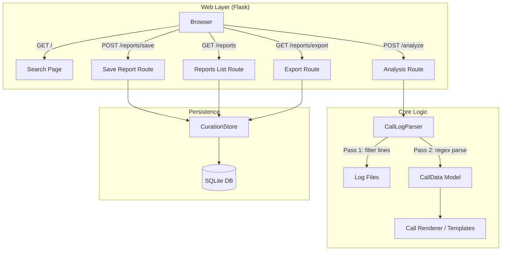
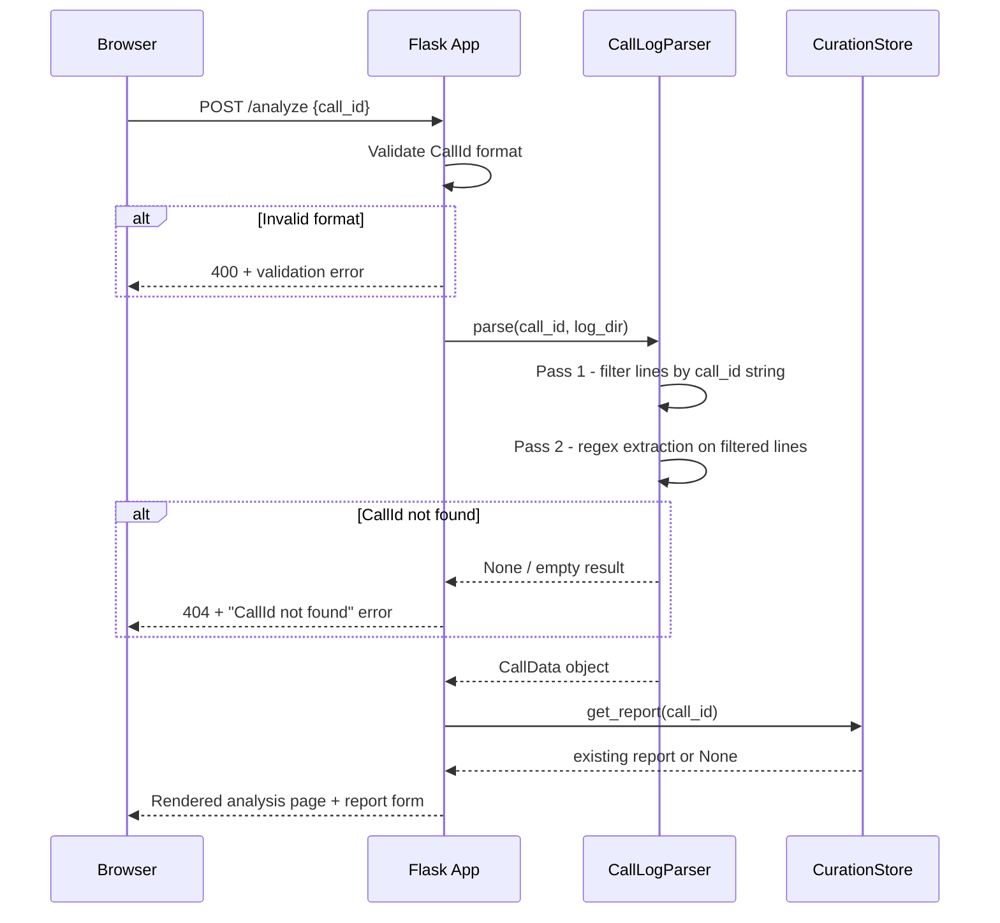

# Design Document: Call Analysis Dashboard

## Overview

The Call Analysis Dashboard is a Flask web application that enables curators and QA analysts to inspect individual AI-orchestrated debt collection calls. The system takes a CallId as input, parses large syslog-format log files (~700MB) from the olos-ai-orchestrator, extracts structured call data, and presents it in a readable web interface. Curators can also write and persist curation reports for each analyzed call.

The architecture follows a clean separation between:
- **Log parsing** (reusable Python module) — efficient two-pass filtering + regex extraction
- **Web layer** (Flask) — routes, templates, and API endpoints
- **Persistence** (SQLite) — local curation report storage

### Key Design Decisions

1. **Two-pass parsing strategy**: First pass does a simple string `in` check for the CallId (fast, no regex), then second pass applies detailed regex patterns only to matching lines. This is critical for performance on ~700MB files.
2. **Reusable parser module**: The call log parser lives in `log_analyzer/apps/call_parser.py` as a standalone module, separate from the Flask app, enabling reuse in CLI tools or notebooks.
3. **Flask with server-side rendering**: Vanilla HTML with Bootstrap 5 via CDN. No heavy frontend framework needed for this tool's complexity level.
4. **SQLite for reports**: Simple, zero-dependency local storage. One file, no server, easy to back up.

## Architecture



### Request Flow



## Components and Interfaces

### 1. CallLogParser (`log_analyzer/apps/call_parser.py`)

The reusable log parsing module. Stateless, functional design.

```python
@dataclass(frozen=True)
class CallData:
    """Immutable result of parsing a call's log entries."""
    call_id: str
    # Customer data
    customer_name: str | None
    cpf: str | None
    phone: str | None
    product: str | None
    company: str | None
    # Debt data
    debt_total: str | None
    debt_discount: str | None
    debt_due_date: str | None
    days_overdue: str | None
    installments_overdue: str | None
    # Call config
    assistant_name: str | None
    tts_supplier: str | None
    ai_models: list[AIModelInfo]
    # Timeline events
    events: list[CallEvent]
    # Conversation
    conversation: list[ConversationMessage]
    # Performance metrics
    tts_latencies: list[int]
    categorizer_latencies: list[float]
    cache_hits: int
    cache_misses: int
    session_summary: SessionSummary | None
    # Problems
    no_voice_timeouts: int
    audio_repetitions: list[AudioRepetition]
    missing_audio_files: list[str]
    hangup_reason: str | None
    error_entries: list[str]
    # Timing
    start_time: datetime | None
    end_time: datetime | None
    raw_mailing_data: dict | None


class CallLogParser:
    """Parses olos-ai-orchestrator syslog files for a specific CallId."""

    def __init__(self, log_directory: str):
        ...

    def parse(self, call_id: str) -> CallData | None:
        """Parse all log files for the given CallId. Returns None if not found."""
        ...

    def _filter_lines(self, call_id: str, file_path: str) -> list[str]:
        """Pass 1: fast string-contains filter."""
        ...

    def _parse_lines(self, call_id: str, lines: list[str]) -> CallData:
        """Pass 2: detailed regex extraction on pre-filtered lines."""
        ...
```

### 2. CallId Validator (`dashboard/validators.py`)

```python
def validate_call_id(call_id: str) -> tuple[bool, str | None]:
    """Validate CallId format. Returns (is_valid, error_message)."""
    # Must be 16-char hexadecimal
    ...
```

### 3. CurationStore (`dashboard/store.py`)

```python
@dataclass
class CurationReport:
    call_id: str
    report_text: str
    created_at: datetime
    modified_at: datetime


class CurationStore:
    """SQLite-backed persistence for curation reports."""

    def __init__(self, db_path: str):
        ...

    def save_report(self, call_id: str, report_text: str) -> CurationReport:
        """Save or update a report. Preserves created_at on updates."""
        ...

    def get_report(self, call_id: str) -> CurationReport | None:
        """Retrieve report by CallId."""
        ...

    def list_reports(self) -> list[CurationReport]:
        """List all reports ordered by modification date (newest first)."""
        ...

    def export_reports(self, call_data_loader: Callable) -> list[dict]:
        """Export all reports with enriched call data."""
        ...
```

### 4. Flask Application (`dashboard/app.py`)

```python
# Routes:
# GET  /                  → Search page (text input for CallId)
# POST /analyze           → Parse call and render analysis
# GET  /analyze/<call_id> → Direct link to call analysis
# GET  /reports           → List all saved reports
# POST /reports/save      → Save a curation report
# GET  /reports/export    → Download JSON export of all reports
```

### 5. Templates (`dashboard/templates/`)

- `base.html` — Bootstrap 5 layout, navbar
- `search.html` — CallId input form with validation
- `analysis.html` — Full call analysis display (sections: customer, debt, config, timeline, conversation, metrics, problems, report form)
- `reports.html` — List of saved reports with preview

## Data Models

### CallEvent (Timeline Event)

```python
class EventType(Enum):
    STAGE_TRANSITION = "stage_transition"
    ASR_TRANSCRIPTION = "asr_transcription"
    BOT_RESPONSE = "bot_response"
    CATEGORIZER_DECISION = "categorizer_decision"
    TTS_GENERATION = "tts_generation"
    ERROR = "error"
    OTHER = "other"


@dataclass(frozen=True)
class CallEvent:
    timestamp: datetime
    event_type: EventType
    content: str
    metadata: dict = field(default_factory=dict)
    # metadata examples:
    #   stage_transition: {"from": "flow_start", "to": "ask_cpc"}
    #   categorizer: {"option": {...}, "confidence": 0.95}
    #   tts: {"latency_ms": 230, "cache": "HIT"}
```

### ConversationMessage

```python
class Speaker(Enum):
    CUSTOMER = "customer"
    ASSISTANT = "assistant"


@dataclass(frozen=True)
class ConversationMessage:
    timestamp: datetime
    speaker: Speaker
    text: str
```

### AIModelInfo

```python
@dataclass(frozen=True)
class AIModelInfo:
    ai_type: str    # staging, finalize, categorizer, summary, call-disposition
    model_name: str
```

### SessionSummary

```python
@dataclass(frozen=True)
class SessionSummary:
    llm_calls: int
    llm_tokens_input: int
    llm_tokens_output: int
    llm_tokens_cached: int
    llm_cost: float
    tts_calls: int
    tts_characters: int
    tts_chunks: int
    tts_bytes: int
    asr_calls: int
    asr_duration_seconds: float
    asr_characters: int
    categorizer_calls: int
```

### AudioRepetition

```python
@dataclass(frozen=True)
class AudioRepetition:
    timestamp: datetime
    repetition_count: int
```

### SQLite Schema (Curation Reports)

```sql
CREATE TABLE IF NOT EXISTS curation_reports (
    call_id TEXT PRIMARY KEY,
    report_text TEXT NOT NULL,
    created_at TEXT NOT NULL,   -- ISO 8601
    modified_at TEXT NOT NULL   -- ISO 8601
);
```

### Regex Patterns (Parser)

Key patterns for log extraction:

| Pattern | Purpose |
|---------|---------|
| `\[CallId: ([a-f0-9]+)\]` | Extract CallId from syslog line |
| `^(\d{4}-\d{2}-\d{2}T\d{2}:\d{2}:\d{2}\.\d+[+-]\d{2}:\d{2})` | Extract ISO timestamp |
| `Processando mensagem de texto: (.+)` | Extract mailing data payload |
| `BUFFER LIMPO.*transcrição='([^']*)'` | Extract ASR transcription |
| `Resposta do assistente: (.+)` | Extract bot response |
| `Transitioning from '([^']+)' to '([^']+)'` | Extract stage transitions |
| `Opção escolhida: (.+), Confiança: ([\d.]+)` | Extract categorizer decision |
| `First ElevenLabs chunk received - latency: (\d+) ms` | TTS first chunk latency |
| `categorizer_client_call took ([\d.]+)ms` | Categorizer latency |
| `cache:(HIT\|MISS)` | TTS cache status |
| `Timeout de detecção de voz expirado` | No-voice timeout |
| `Sequência de áudios repetida (\d+) vez` | Audio repetition count |
| `Arquivo de áudio.*não encontrado.*?'([^']+)'` | Missing audio file path |
| `WebSocket fechado após hangup por (\w+)` | Hangup reason |
| `Session summary: (.+)` | Session summary |

## Correctness Properties

*A property is a characteristic or behavior that should hold true across all valid executions of a system — essentially, a formal statement about what the system should do. Properties serve as the bridge between human-readable specifications and machine-verifiable correctness guarantees.*

### Property 1: Invalid CallId rejection

*For any* string that is not exactly 16 hexadecimal characters, the CallId validator SHALL reject it and return an error message.

**Validates: Requirements 1.5**

### Property 2: Syslog line parsing round-trip

*For any* valid syslog line matching the olos-ai-orchestrator format, parsing it SHALL extract a timestamp, severity level, module name, CallId, and message body such that they can reconstruct the essential content of the original line.

**Validates: Requirements 2.2**

### Property 3: Mailing data extraction preserves fields

*For any* valid mailing data dictionary embedded in a "Processando mensagem de texto" log line, the parser SHALL extract customer name, CPF, phone, product, company, debt values, and due date matching the original values.

**Validates: Requirements 2.5**

### Property 4: Call data rendering includes all non-null fields

*For any* valid CallData with non-null customer, debt, and configuration fields, the rendered HTML output SHALL contain string representations of all non-null field values.

**Validates: Requirements 3.1, 3.2, 3.3**

### Property 5: Missing fields produce placeholders

*For any* CallData where a subset of customer/debt fields are None, the rendered output SHALL contain a placeholder indicator for each missing field.

**Validates: Requirements 3.4**

### Property 6: Timeline chronological ordering

*For any* set of CallEvent objects with timestamps, the rendered timeline SHALL present them in non-decreasing timestamp order.

**Validates: Requirements 4.1**

### Property 7: Stage transition prefix stripping

*For any* stage transition event with stage names containing an application prefix (e.g., "FastFlowCloud-ADA-Cob-Generic-Company-flow_start"), the displayed stage name SHALL contain only the suffix after the last hyphen-separated prefix segment.

**Validates: Requirements 4.2**

### Property 8: ASR transcription extraction round-trip

*For any* non-empty text string, embedding it in the pattern `BUFFER LIMPO ... transcrição='TEXT'` and extracting with the parser SHALL produce the original text.

**Validates: Requirements 5.3**

### Property 9: Bot response extraction round-trip

*For any* text string (not containing newlines), embedding it in the pattern `Resposta do assistente: TEXT` and extracting with the parser SHALL produce the original text.

**Validates: Requirements 5.4**

### Property 10: Conversation chronological order with speaker labels

*For any* list of ConversationMessage objects, the rendered conversation SHALL preserve chronological order and each message SHALL be labeled with its speaker type (Customer or Assistant).

**Validates: Requirements 5.1, 5.2**

### Property 11: Latency metric computation correctness

*For any* non-empty list of latency values (integers or floats), the computed average SHALL equal the arithmetic mean and the max SHALL equal the maximum value in the list.

**Validates: Requirements 6.1, 6.2**

### Property 12: Cache hit/miss ratio computation

*For any* sequence of cache hit and miss events (at least one event), the displayed ratio SHALL equal hits / (hits + misses).

**Validates: Requirements 6.3**

### Property 13: Problem count accuracy

*For any* set of log lines containing N timeout events, M audio repetition events, and K error-level entries, the problem display SHALL show counts N, M, and K respectively.

**Validates: Requirements 7.1, 7.2, 7.5**

### Property 14: Curation report persistence round-trip

*For any* valid CallId and non-empty report text, saving a report and then retrieving it by CallId SHALL return the same text, and the report SHALL have non-null created_at and modified_at timestamps.

**Validates: Requirements 8.2, 9.2**

### Property 15: Report update preserves creation timestamp

*For any* existing report that is updated with new text, the creation timestamp SHALL remain unchanged while the modification timestamp SHALL be greater than or equal to the original modification timestamp.

**Validates: Requirements 9.3**

### Property 16: Multiple reports independence

*For any* set of N distinct CallIds each with a unique report, all N reports SHALL be independently retrievable and the listing SHALL contain exactly N entries.

**Validates: Requirements 9.4, 10.1**

### Property 17: Export completeness

*For any* set of saved reports, the JSON export SHALL contain all reports, and each exported entry SHALL include CallId, report text, creation timestamp, and modification timestamp.

**Validates: Requirements 10.3, 10.4**

## Error Handling

### Parser Errors

| Scenario | Handling |
|----------|----------|
| Log file not found | Log warning, skip file, continue searching other files |
| Encoding error in line | Use `errors='replace'` — replace invalid bytes with `�`, continue parsing |
| Malformed mailing JSON | Set `raw_mailing_data = None`, log warning, extract available fields |
| Regex pattern doesn't match | Skip the line for that specific extraction, continue with next line |
| CallId not found in any file | Return `None` from parser; Flask returns 404 with clear message |
| Log directory empty | Return `None`; Flask returns 404 with "No log files found" message |

### Web Layer Errors

| Scenario | Handling |
|----------|----------|
| Invalid CallId format | Return 400 with validation error before parsing starts |
| Parser returns None | Return 404 with "CallId not found" message |
| Parser exceeds timeout | Not enforced in Phase 1; future: background task + polling |
| SQLite write failure | Return 500 with "Failed to save report" message; log full error |
| Export with no reports | Return empty JSON array `[]` |

### Curation Store Errors

| Scenario | Handling |
|----------|----------|
| DB file doesn't exist | Create it on first access (auto-migrate schema) |
| Concurrent writes | SQLite handles via file locking; retry once on BUSY |
| Corrupt DB | Catch `sqlite3.DatabaseError`, return 500, suggest re-creating DB |

## Testing Strategy

### Property-Based Testing (Hypothesis)

The project already uses Hypothesis for property-based testing. Each correctness property maps to a property-based test with minimum 100 iterations.

**Library**: `hypothesis` (already in dev dependencies)

**Test configuration**:
- Minimum 100 examples per property (`@settings(max_examples=100)`)
- Tag format: `# Feature: call-analysis-dashboard, Property N: <description>`

**Target areas for PBT**:
- CallId validation (Property 1)
- Log line parsing / extraction round-trips (Properties 2, 3, 8, 9)
- Rendering completeness (Properties 4, 5)
- Timeline ordering (Property 6)
- Metric computations (Properties 11, 12, 13)
- Report persistence round-trips (Properties 14, 15, 16, 17)

### Unit Tests (pytest)

- Specific examples using real log line samples from the project's `logs/` directory
- Edge cases: empty log files, calls with zero events, single-line calls
- Integration between parser and renderer with known inputs
- Flask route responses (status codes, content type)

### Integration Tests

- Full flow: submit CallId → parse → render → verify HTML structure
- Report CRUD cycle: save → retrieve → update → list → export
- Multi-file search: CallId in second/third log file

### Manual Testing

- Visual inspection of rendered timeline and conversation
- Bootstrap responsiveness on different screen sizes
- Large file parsing performance verification (~700MB)

### Test File Structure

```
tests/
├── test_call_parser.py           # Unit tests for parser
├── test_call_parser_property.py  # PBT for parser (Properties 1-3, 8-9)
├── test_curation_store.py        # Unit tests for SQLite store
├── test_curation_store_property.py  # PBT for store (Properties 14-17)
├── test_dashboard_routes.py      # Flask route tests
├── test_rendering_property.py    # PBT for rendering (Properties 4-7, 10-13)
└── conftest.py                   # Shared fixtures
```
