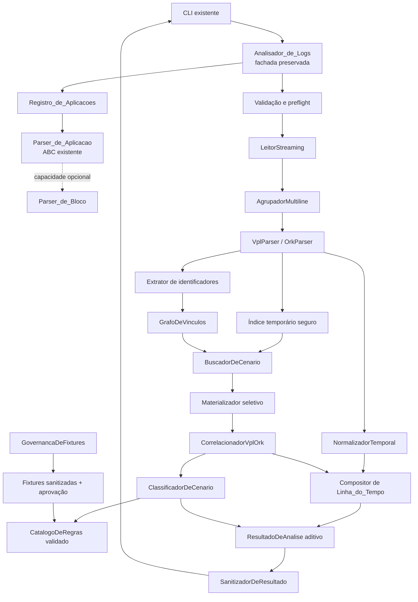
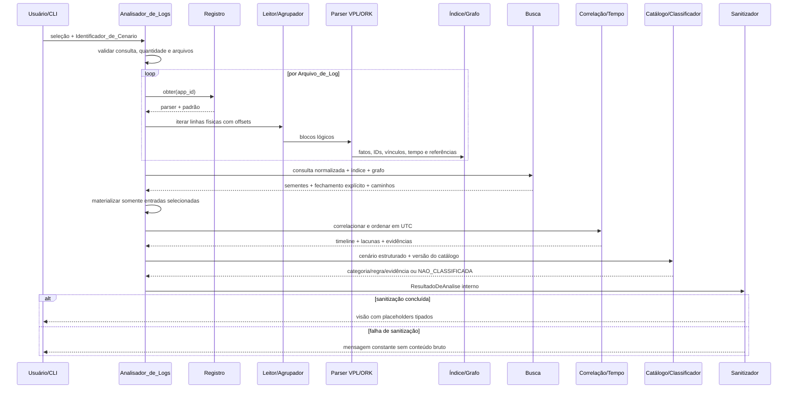

# Design Document

## Overview

A **Fase 2 do Analisador_de_Logs** evolui o núcleo Python 3.11 da Fase 1 para interpretar os
formatos reais de VPL e ORK, preservar blocos multiline, normalizar tempo, extrair e relacionar
identificadores técnicos, correlacionar as duas Aplicações e classificar cenários somente quando
uma regra versionada possuir evidência rotulada e aprovação de domínio. A evolução é aditiva: a
fachada `Analisador_de_Logs.analisar`, os contratos abstratos de plugin, o
`Registro_de_Aplicacoes`, os campos públicos existentes, o enum `Categoria`, os app IDs e a
sintaxe posicional da CLI permanecem válidos.

A classificação da Fase 2 é deliberadamente uma **classificação de cenário**, separada da
`Severidade_de_Log` e da classificação por entrada já exposta na Fase 1. Uma entrada com
severidade `ERROR` ou equivalente não torna o cenário `ERRO`. Sem uma `Regra_Validada` que
corresponda integralmente, o resultado é `NAO_CLASSIFICADA`; sem uma regra causal aprovada, a
`Causa_Raiz` é `não determinada`.

### Pesquisa realizada e achados que orientam o design

A pesquisa foi somente leitura e usou como fonte normativa o `requirements.md` aprovado. Foram
inspecionados seletivamente:

- `log_analyzer/core/interfaces.py`, `modelos.py`, `analisador.py`, `registro.py`,
  `carregador.py`, `filtro.py`, `correlacao.py`, `ordenacao.py` e `bootstrap.py`;
- `log_analyzer/apps/vpl.py`, `ork.py`, `voci.py` e `padroes.py`;
- `log_analyzer/cli/main.py` e `apresentacao.py`;
- os testes atuais de modelos, plugins, parsers, filtro, correlação, ordenação, CLI, bootstrap,
  robustez e propriedades Hypothesis;
- somente a estrutura inicial das amostras locais VPL e ORK, sem transportar valores para este
  documento.

Os achados relevantes são:

1. `Parser_de_Aplicacao` e `Padrao_de_Analise` são ABCs estáveis, e o registro valida essas
   interfaces por `isinstance`. Adicionar novo método abstrato quebraria plugins existentes.
2. `EntradaDeLog` é um `dataclass(frozen=True)`; `ResultadoDeAnalise` mantém listas e dicionários
   mutáveis. Os novos campos devem ser acrescentados ao final e possuir defaults.
3. O carregador atual lê por iterador, mas converte o arquivo inteiro em `list[str]`. O caminho
   principal da Fase 2 precisa evitar essa materialização sem remover `carregar_arquivo`.
4. A busca atual é substring case-insensitive em `texto_original`; a correlação atual presume
   vínculo quando ambos os lados produziram entradas filtradas. A Fase 2 substituirá essa
   presunção internamente por valor tipado compartilhado ou cadeia explicitamente evidenciada.
5. A CLI atual usa `python -m log_analyzer <identificador> <app_id>:<caminho> [...]`. Essa forma,
   os app IDs `VPL`, `ORK` e `VOCI`, e os imports exportados por `log_analyzer.core` permanecem.
6. A suíte já usa Hypothesis com pelo menos 100 exemplos. Os formatos sintéticos legados dos
   parsers também estão protegidos por testes e serão mantidos como perfis de compatibilidade.
7. Há utilitários e um dashboard legados fora do pipeline de plugins que manipulam conteúdo
   bruto. Eles não são fonte autorizada de regra, exemplo rotulado ou saída segura da Fase 2.
8. As amostras confirmam, sem necessidade de reproduzir dados: VPL possui timestamp local,
   percentual operacional, severidade delimitada, origem e mensagem; ORK possui timestamp ISO
   8601 com offset, host, processo, severidade, logger e mensagem.

### Objetivos

- Interpretar VPL e ORK reais em streaming e com agrupamento multiline determinístico.
- Preservar texto, quebras de linha, posições, campos e falhas sem descartar entradas.
- Produzir timestamps UTC comparáveis sem sobrescrever a representação temporal original.
- Extrair identificadores somente de campos/posições conhecidas, com tipo e proveniência.
- Criar vínculos somente quando uma declaração semântica explícita os sustentar.
- Buscar por igualdade estruturada, usar fallback literal e expandir apenas por vínculos válidos.
- Correlacionar VPL–ORK com evidência auditável e compor linha do tempo comum.
- Classificar o cenário por catálogo versionado, aprovado e fail-closed.
- Sanitizar toda fronteira de apresentação, exportação e diagnóstico.
- Manter compatibilidade de código, CLI e comportamento VOCI da Fase 1.
- Processar lotes de até 100 arquivos de até 500 MB sem manter todo o texto bruto em RAM.

### Não objetivos

- Criar novos formatos, regras ou diagnósticos para VOCI.
- Inferir causa-raiz ou categoria a partir de severidade, proximidade temporal ou similaridade.
- Definir neste design marcadores universais de sucesso ou erro.
- Ativar uma regra do cenário dourado antes da aprovação das condições necessárias e
  suficientes pelo `Responsavel_de_Dominio`.
- Importar automaticamente relatórios do dashboard, `curation.db` ou scripts exploratórios como
  `Exemplo_Rotulado`.
- Persistir logs brutos, conteúdo de cliente ou índices reversíveis de identificadores.
- Modernizar o dashboard legado; a integração segura dele pode ser uma entrega posterior.

### Princípios de design

1. **Compatibilidade aditiva**: nenhum contrato público existente é removido ou reinterpretado.
2. **Evidência antes de conclusão**: correlação, categoria e causa-raiz apontam para evidências.
3. **Fail-closed**: ambiguidade, catálogo inválido, regra não aprovada ou sanitização incompleta
   nunca produzem uma conclusão positiva.
4. **Minimização de dados**: texto bruto permanece na fonte ou em memória transitória; índices
   temporários contêm metadados e digests não reversíveis.
5. **Determinismo**: entrada, versão de catálogo e configuração iguais produzem a mesma ordem,
   categoria e justificativa estrutural.
6. **Separação semântica**: severidade da linha, categoria por entrada, categoria do cenário e
   causa-raiz são campos independentes.

### Impacto e compatibilidade com a Fase 1

| Contrato atual | Decisão da Fase 2 |
|---|---|
| `Parser_de_Aplicacao` | Mantém os três membros abstratos atuais. VPL/ORK implementam também um protocolo opcional de bloco; plugins antigos não precisam mudar. |
| `Padrao_de_Analise.classificar(EntradaDeLog)` | Permanece válido e por entrada. A classificação multiaplicação usa um novo `ClassificadorDeCenario`. |
| `Registro_de_Aplicacoes` | Mantém `registrar`, `obter`, `aplicacoes_suportadas` e `esta_registrada`; continua registrando plugins da Fase 1. |
| `Analisador_de_Logs.analisar(selecao, identificador)` | Assinatura e tipo de retorno preservados; a implementação interna usa o pipeline da Fase 2 apenas para VPL/ORK. |
| `Categoria` | Mantém exatamente `SUCESSO`, `ERRO` e `NAO_CLASSIFICADA`, inclusive valores existentes. |
| `EntradaDeLog` | Campos existentes mantêm ordem, nomes, tipos e significado; campos opcionais novos são anexados. |
| `ResultadoDeAnalise` | Campos atuais permanecem; categoria de cenário, IDs, vínculos, evidências e cobertura são aditivos. |
| `carregar_arquivo` | Continua retornando `list[str] | MensagemDeErro` para consumidores legados; o orquestrador usa um novo leitor incremental interno. |
| `filtrar_por_identificador` | Continua disponível como wrapper legado; o pipeline novo usa `BuscadorDeCenario`. |
| `correlacionar_vpl_ork` | Continua disponível; delega à correlação evidenciada quando os metadados novos existem e mantém compatibilidade para entradas legadas que compartilham literalmente a consulta. |
| `ordenar_linha_do_tempo` | Continua disponível para listas legadas; o pipeline novo usa a partição por `timestamp_normalizado`. |
| CLI | Preserva argumentos posicionais, app IDs e códigos básicos; acrescenta seções e sanitiza valores. |
| VOCI | Continua no fluxo e gramática da Fase 1, sem catálogo ou regras novas da Fase 2. |

Mudanças de apresentação exigidas por segurança são intencionais: o objeto interno ainda preserva
os dados necessários à auditoria, mas a CLI deixa de ecoar o identificador e o texto bruto quando
contiverem `Dado_Sensivel`; a saída usa placeholders tipados.

### Mapa de requisitos

| Requisitos | Seções/componentes principais |
|---|---|
| 1, 16 | Compatibilidade, protocolos opcionais, modelos aditivos, CLI e migração |
| 2, 3 | `VplParser`, `OrkParser`, perfis de gramática e extratores tipados |
| 4, 5 | `AgrupadorMultiline`, referências de origem, materialização e pretty-printers |
| 6 | `NormalizadorTemporal` e composição da linha do tempo |
| 7 | `NormalizadorDeIdentificador`, índice e `BuscadorDeCenario` |
| 8 | `GrafoDeVinculos` e esquemas explícitos de relação |
| 9 | `CorrelacionadorVplOrk`, timeline e explicação |
| 10–12 | `CatalogoDeRegras`, validador, aprovação e classificador de cenário |
| 13 | Evidências, referências de regra e visão explicável |
| 14 | Sanitização, scanner e governança de fixtures |
| 15 | Streaming, isolamento de falhas, decodificação e resultados parciais |
| 17 | Cobertura, lacunas, versão do catálogo e limites de diagnóstico |

## Architecture

A arquitetura preserva Apresentação → Orquestração → Registro/Plugins, acrescentando serviços
puros entre parsing e composição do resultado. O núcleo continua sem importar implementações
concretas de VPL/ORK; capacidades específicas são descobertas por um protocolo opcional.



### Fronteiras de confiança

- **Não confiável e sensível**: bytes dos arquivos, nomes/caminhos, mensagens, identificadores e
  metadados de cliente.
- **Interno transitório**: texto original materializado, valores originais de identificadores e
  mapa de sanitização; nunca são emitidos em logs diagnósticos.
- **Confiável somente após validação**: catálogo, manifestos de fixtures e registros de aprovação.
- **Seguro para saída**: uma cópia de `ResultadoDeAnalise` com
  `estado_sanitizacao=CONCLUIDA`, ou uma mensagem constante de falha.

### Fluxo end-to-end



Passos detalhados:

1. Validar o identificador com as regras atuais de 1–256 caracteres e validar no máximo 100
   arquivos regulares de até 500 MB.
2. Resolver parser/padrão pelo `Registro_de_Aplicacoes`. VOCI segue o caminho legado; VPL/ORK
   usam `Parser_de_Bloco`.
3. Atribuir a cada arquivo um token local (`<ARQUIVO_1>`, `<ARQUIVO_2>`) e fazer preflight sem
   registrar o caminho bruto.
4. Ler bytes sequencialmente, preservar offsets e terminadores, decodificar UTF-8 estritamente e
   alimentar a máquina multiline.
5. Produzir uma `EntradaIndexada` leve por bloco: posições, hash do bloco, cabeçalho estruturado,
   tempo, fatos de regra, digests de identificadores e falhas. O texto completo permanece
   referenciado por intervalo no arquivo.
6. Construir índice invertido e grafo. Valores usados em igualdade são indexados por HMAC-SHA-256
   com chave aleatória da análise e namespace do tipo; o índice temporário não guarda valores
   originais.
7. Aplicar a busca estruturada; por entrada sem match estruturado, testar a consulta literal no
   fluxo de texto. Deduplicar por `entrada_id`.
8. Expandir sementes por arestas explícitas não ambíguas e registrar os caminhos percorridos.
9. Reabrir/consultar os intervalos selecionados, verificar identidade do arquivo e hash do bloco,
   e então materializar `texto_original` e `mensagem`. Uma alteração concorrente no arquivo gera
   falha do item em vez de combinar versões.
10. Correlacionar VPL/ORK somente por valor compartilhado de namespace compatível ou cadeia
    explícita; normalizar tempo e separar entradas sem instante resolvido.
11. Avaliar somente regras `ACTIVE` de um catálogo integralmente validado. A avaliação é pura e
    recebe fatos estruturados, não texto arbitrário.
12. Compor o resultado interno, criar a visão sanitizada e renderizar. O mapa bruto→placeholder é
    descartado ao final da análise.

### Streaming, armazenamento transitório e limites de memória

O caminho principal não chama `list(_ler_linhas(...))`. `LeitorStreaming` lê em modo binário e
mantém apenas a linha corrente, estado do bloco, hash incremental e fatos extraídos. O índice usa
memória até um limiar configurável e depois migra para SQLite temporário com permissão restrita.
O índice armazena tokens de arquivo, posições, timestamps, códigos, HMACs e arestas; não armazena
texto, caminhos, valores de identificador nem conteúdo de cliente.

A complexidade em RAM é `O(estado_do_bloco + índice_ativo + grafo + resultado_selecionado)`, e
não `O(total_de_bytes_dos_arquivos)`. A materialização de uma entrada selecionada muito grande é
inevitavelmente proporcional ao tamanho dessa saída por causa do campo público `texto_original`.
A CLI ganha um iterador de renderização segura para não criar uma segunda cópia integral; a função
pública `renderizar_resultado` continua disponível como wrapper que junta o iterador.

Arquivos de entrada regulares e estáveis são a fonte do segundo passe. Para cada bloco são
registrados intervalo de bytes e SHA-256; antes da materialização são validados identidade,
tamanho, `mtime_ns` e hash do intervalo. Índices temporários são apagados em `finally`; um limpador
de inicialização remove resíduos antigos pelo nome/timestamp sem abrir ou registrar conteúdo.

## Components and Interfaces

### Contratos de plugin preservados e capacidade opcional

Os métodos abstratos existentes não mudam. O suporte a blocos é um protocolo adicional e não
participa da validação obrigatória de `Registro_de_Aplicacoes`:

```python
from enum import Enum
from typing import Iterable, Protocol, runtime_checkable

class TipoInicio(Enum):
    CABECALHO_VALIDO = "cabecalho_valido"
    CABECALHO_APARENTE_INVALIDO = "cabecalho_aparente_invalido"
    CONTINUACAO = "continuacao"

# ABC existente: assinaturas preservadas.
class Parser_de_Aplicacao(ABC):
    @property
    @abstractmethod
    def niveis_de_severidade(self) -> frozenset[str]: ...

    @abstractmethod
    def interpretar_entrada(self, texto: str) -> EntradaDeLog: ...

    @abstractmethod
    def imprimir_entrada(self, entrada: EntradaDeLog) -> str: ...

    def interpretar_arquivo(self, linhas: Iterable[str]) -> list[EntradaDeLog]:
        return [self.interpretar_entrada(linha) for linha in linhas]

@runtime_checkable
class Parser_de_Bloco(Protocol):
    def detectar_inicio(self, linha: "LinhaFisica") -> TipoInicio: ...
    def interpretar_bloco(self, bloco: "BlocoLog") -> "EntradaIndexada": ...
```

`VplParser` e `OrkParser` continuam subclasses de `Parser_de_Aplicacao` e passam a implementar o
protocolo opcional. `VociParser` e plugins de terceiros continuam line-based. Chamadas diretas a
`interpretar_entrada`, `imprimir_entrada` e `interpretar_arquivo` mantêm o comportamento público;
o orquestrador usa a capacidade de bloco somente quando disponível.

`Padrao_de_Analise` também permanece inalterado. `VplPadrao`, `OrkPadrao` e `VociPadrao` continuam
produzindo uma categoria por entrada. As regras multiaplicação ficam em outro componente para não
forçar uma regra de cenário em um plugin individual.

### `LeitorStreaming`

Responsabilidades:

- repetir as validações de existência, legibilidade, arquivo regular, vazio e 500 MB;
- produzir `LinhaFisica(numero_1_based, inicio_byte, fim_byte, texto, terminador)`;
- preservar `LF`, `CRLF` e ausência de terminador final;
- calcular fingerprint do arquivo e hash incremental de cada bloco;
- decodificar UTF-8 com `errors="strict"`, nunca substituir bytes silenciosamente;
- em falha de decodificação, produzir um item com posição, tamanho e hash, sem incluir bytes na
  mensagem de erro.

`carregar_arquivo` permanece como adapter legado e mantém seu tipo de retorno atual. Novos erros
seguem a hierarquia `ErroDoAnalisador`, mas são convertidos em registros estruturados pelo
orquestrador.

### `AgrupadorMultiline`

A máquina possui dois estados: `SEM_BLOCO` e `BLOCO_ABERTO`. A detecção é trivalente para impedir
que uma linha que parece novo evento, mas está malformada, seja anexada ao evento anterior.

| Estado | Entrada | Ação |
|---|---|---|
| `SEM_BLOCO` | cabeçalho válido | abrir bloco interpretável |
| `SEM_BLOCO` | cabeçalho aparente inválido | abrir bloco marcado não interpretável |
| `SEM_BLOCO` | continuação | emitir entrada não interpretada autônoma |
| `BLOCO_ABERTO` | cabeçalho válido | finalizar bloco anterior e abrir novo |
| `BLOCO_ABERTO` | cabeçalho aparente inválido | finalizar anterior e abrir bloco não interpretável |
| `BLOCO_ABERTO` | continuação | anexar intervalo, terminador, hash e fatos incrementais |
| qualquer estado | EOF | finalizar bloco aberto uma vez; não emitir item vazio |

Cada linha recebe exatamente um `entrada_id`; intervalos das entradas são contíguos, disjuntos e
cobrem todas as linhas. Uma linha indecodificável anexada a bloco aberto marca o bloco com falha
de decodificação; sem bloco aberto, forma uma entrada autônoma segura. O agrupador não usa tempo,
proximidade, identificador ou conteúdo semântico para decidir associação.

### `VplParser`: formato real e compatibilidade

O perfil real é reconhecido por uma gramática ancorada e analisada em etapas, representada sem
valores reais:

```text
[<UUID_CANAL_1> ]<AAAA-MM-DD> <HH:MM:SS>.<1..6 dígitos>
<PERCENTUAL_OPERACIONAL>% [<SEVERIDADE>] <ORIGEM> <MENSAGEM_NAO_VAZIA>
```

Os espaços acima representam separadores da mesma linha. O UUID inicial é opcional e só é
interpretado como UUID de canal/sessão nessa posição aprovada. O detector considera
`CABECALHO_APARENTE_INVALIDO` uma linha que começa com o prefixo temporal esperado, com ou sem
UUID, mas falha em timestamp, percentual, severidade, origem ou mensagem.

A implementação evita uma regex monolítica com backtracking: separa prefixo opcional, timestamp,
percentual, token delimitado de severidade, origem e resto da mensagem. Campos preservados:
`timestamp_original`, precisão fracionária, percentual original, severidade, origem, mensagem e
perfil de formato.

Extratores VPL reconhecem somente:

- os nomes aprovados `CALLID`, `CallId` e `call-id`;
- o identificador na posição de usuário de endereço de canal SIP reconhecido;
- UUID na posição inicial do cabeçalho ou em posição explicitamente rotulada como canal/sessão.

Uma sequência com aparência de UUID fora desses contextos não vira `Identificador_Tecnico`.
Unicode válido permanece inalterado. O perfil sintético da Fase 1 continua aceito depois do perfil
real, preservando os testes e consumidores existentes; `formato_origem` registra qual perfil
casou.

### `OrkParser`: formato real e compatibilidade

O perfil real usa a seguinte gramática estrutural:

```text
<TIMESTAMP_ISO8601_COM_OFFSET> <HOST> <PROCESSO>[<PID>]:
<SEVERIDADE> - <LOGGER> - <MENSAGEM_NAO_VAZIA>
```

A interpretação é staged: timestamp; host sem whitespace; processo e PID; severidade; delimitador
fixo; logger não vazio; segundo delimitador; mensagem. O timestamp do perfil real exige offset
explícito (`Z` ou `±HH:MM`). Uma linha com prefixo ISO aparente que falha em qualquer campo
obrigatório inicia uma entrada não interpretada própria.

Extratores ORK reconhecem `TelecomCallId`, `CallId` e UUIDs de sessão somente quando o campo ou o
contexto aprovado os rotula. Hostnames, PIDs, outros números e UUIDs incidentais não são usados
como vínculo. O formato pipe-delimited sintético da Fase 1 permanece como perfil legado. Se um
perfil legado contiver timestamp sem offset, a entrada pode continuar `interpretada=True` para
compatibilidade, mas recebe falha temporal e não entra na nova cronologia UTC.

### Preservação, materialização e round-trip

`ReferenciaTextoOriginal` contém token de arquivo, intervalo de bytes, linhas inicial/final,
terminadores e SHA-256. A referência é a representação interna lossless durante o primeiro passe;
`texto_original` é materializado exatamente, inclusive quebras, para entradas que entram no
resultado ou são solicitadas pela API legada.

Os pretty-printers seguem estas regras:

- entrada não interpretada: retorna o texto original materializado sem alteração;
- entrada real: produz representação canônica do mesmo perfil com todos os campos estruturados e
  conteúdo multiline;
- entrada de perfil legado: continua imprimindo um formato aceito pelo parser legado;
- `parse(print(parse(x)))` preserva timestamp original/normalizado, precisão, severidade, origem
  ou logger, mensagem, campos estruturados e identificadores; não promete identidade textual da
  forma canônica.

A extração, normalização, busca, correlação e classificação trabalham sobre cópias imutáveis ou
metadados associados e nunca sobrescrevem `texto_original`.

### `NormalizadorTemporal`

O componente usa `datetime` e `zoneinfo.ZoneInfo` da biblioteca padrão.

- **VPL real**: interpreta o datetime sem offset em `ZoneInfo("America/Sao_Paulo")`. São gerados
  candidatos `fold=0` e `fold=1`, convertidos para UTC e reconvertidos para a zona. Zero candidatos
  válidos significa horário inexistente; dois instantes distintos significam horário ambíguo.
  Ambos os casos produzem `FalhaTemporal`, sem escolher silenciosamente um instante.
- **ORK real**: exige datetime aware e usa exatamente o offset fornecido antes de converter para
  UTC.
- **Precisão**: o parser aceita e registra a quantidade observada de dígitos fracionários de 0 a
  6; a representação UTC usa a mesma precisão. Precisão maior que a suportada pelo modelo é
  falha explícita, não truncamento silencioso.
- **Compatibilidade**: `carimbo_de_tempo` mantém a representação `datetime` que os parsers da
  Fase 1 já expõem. `timestamp_original` e `timestamp_normalizado` são aditivos; somente o último
  participa da nova linha do tempo.

A timeline contém apenas entradas com `timestamp_normalizado` válido e é ordenada por:

```text
(timestamp_normalizado, aplicacao, ordem_de_leitura)
```

Entradas sem normalizado ficam em `entradas_sem_ordenacao_temporal`, ordenadas somente para
apresentação por `(aplicacao, arquivo_token, posicao_inicial)`, sem fingir ordem cronológica.

### Extração e normalização de identificadores

`NormalizadorDeIdentificador` recebe tipo, nome do campo, valor e proveniência. A normalização:

1. remove somente whitespace e delimitadores sintáticos externos aprovados;
2. usa `casefold()` para comparação case-insensitive;
3. valida UUID por `uuid.UUID` somente quando o contexto declara UUID;
4. preserva hífens, caracteres internos e o valor original;
5. não decodifica, concatena ou aproxima valores sem regra explícita;
6. associa um `namespace_comparacao` para permitir equivalência sem perder o tipo do campo.

Por exemplo, um identificador externo VPL e os campos ORK `TelecomCallId`/`CallId` podem
compartilhar o namespace de chamada externa, mas continuam três ocorrências tipadas com
proveniências distintas. UUID de canal e UUID de sessão permanecem nós distintos mesmo se uma
colisão textual improvável ocorrer.

A proveniência registra token de arquivo, `entrada_id`, linhas, span de caracteres quando
conhecido, nome do campo e versão da regra de extração. Caminho bruto e valor original só existem
na visão interna.

### `GrafoDeVinculos`

O grafo possui nós de identificadores tipados e arestas `VinculoIdentificadores`. Uma aresta só é
criada por um `EsquemaDeVinculo` versionado que reconhece uma declaração semântica: mapeamento,
nomeação ou contextualização explícita dos dois papéis na mesma entrada. O esquema define tipo da
relação, cardinalidade e se a relação permite expansão de cenário.

Não criam aresta:

- mera coexistência de dois valores na entrada;
- proximidade temporal;
- linhas consecutivas;
- prefixos ou similaridade textual;
- compartilhamento de host, processo ou severidade.

A travessia usa BFS determinística com vizinhos ordenados por `(tipo, digest, entrada_id)`. Cada
passo guarda a aresta e a evidência. Restrições de cardinalidade detectam, por exemplo, um
identificador de papel unitário ligado explicitamente a duas raízes incompatíveis. O componente
conectado é marcado `AMBIGUO`; suas arestas podem ser exibidas, mas não sustentam expansão para
classificação.

Os `EsquemaDeVinculo` concretos dependem das declarações observadas e aprovadas. Nenhum esquema é
criado neste design apenas porque dois IDs aparecem juntos.

### `BuscadorDeCenario`

A consulta já está disponível durante o primeiro passe. O algoritmo por entrada é:

1. normalizar a consulta no namespace aplicável;
2. comparar por igualdade com todos os `Campo_Estruturado_Conhecido` indexados;
3. se nenhum campo da entrada for igual, procurar a consulta literal no `Texto_Original` por
   `casefold`, inclusive em continuações;
4. adicionar a entrada a um conjunto ordenado por `entrada_id`;
5. partir dos identificadores técnicos correspondentes e percorrer somente arestas explícitas,
   não ambíguas e autorizadas para expansão;
6. acrescentar entradas que possuam identificadores alcançados ou evidenciem as arestas;
7. registrar caminho e motivo de inclusão; nunca incluir a mesma entrada duas vezes.

O fallback literal é aplicado à consulta original, não cria um identificador ou vínculo novo e
não exige igualdade com o bloco inteiro. Entradas alcançadas por grafo são encontradas pelo índice
de identificadores tipados; não se faz uma varredura por similaridade para cada nó.

### `CorrelacionadorVplOrk` e explicabilidade

O correlacionador recebe somente entradas selecionadas. Há três bases possíveis:

- `VALOR_COMPARTILHADO`: ao menos uma ocorrência VPL e uma ORK têm mesmo valor normalizado em
  namespaces compatíveis;
- `CADEIA_DE_VINCULOS`: existe caminho explícito não ambíguo entre identificadores das duas apps;
- `NENHUMA`: não há evidência suficiente.

Quando as duas primeiras coexistem, ambas são registradas; `base_primaria` usa
`VALOR_COMPARTILHADO` por ser o caminho mais curto, sem descartar a cadeia. O booleano público
`correlacionada` é atualizado para compatibilidade somente nas entradas cobertas pela evidência;
`correlacao_encontrada` deriva da existência de ao menos uma correlação válida.

Cada explicação inclui apps, posições, timestamps original/normalizado, campo ou relação,
`entrada_id`, regra de extração/vínculo e representação sanitizada. Ausência ou falha de um lado
produz resultado parcial e uma lacuna, não uma correlação vazia artificial.

### `CatalogoDeRegras` e `ClassificadorDeCenario`

O catálogo é um artefato declarativo JSON versionado, carregado atomicamente e validado antes de
qualquer avaliação. Regras candidatas ficam fora da lista `active_rules`; não são interpretadas
como código. A DSL permite somente predicados tipados e totalizados, como presença de Aplicação,
campo estruturado, relação explícita, fato de parser, cardinalidade e ordem temporal válida. Não
permite `eval`, import, SQL, template executável nem regex arbitrária fornecida por usuário.

Uma `RegraValidada` contém:

- `rule_id` estável e versão imutável;
- categoria de cenário e Aplicações abrangidas;
- conjunto completo de predicados e seletores de evidência;
- IDs e SHA-256 das fixtures sanitizadas de suporte;
- precedência explícita no manifesto do catálogo;
- estado (`DRAFT`, `CANDIDATE`, `APPROVED`, `ACTIVE`, `RETIRED`);
- identidade do aprovador de domínio, data e referência de aprovação;
- política de amostras/diversidade e relatório de avaliação;
- causa-raiz somente quando existir regra causal aprovada.

A avaliação considera apenas `ACTIVE`, exige que todos os predicados da regra sejam verdadeiros e
retorna a primeira regra na ordem de precedência versionada. Sobreposição sem ordem explícita
impede a ativação do catálogo. Erro de carregamento ou avaliação torna a categoria
`NAO_CLASSIFICADA`.

#### Ativação segura da regra do Cenário_Dourado

Este design **não define os marcadores necessários/suficientes** do cenário dourado. A regra só
pode ser ativada quando todos os gates seguintes passarem:

1. fixture VPL/ORK sanitizada e aprovada pela `GovernancaDeFixtures`;
2. manifesto com digest e declaração de que há um único exemplo de sucesso e zero de erro;
3. definição declarativa exata dos predicados necessários e suficientes;
4. evidência de que a fixture satisfaz todos os predicados;
5. testes near-miss removendo cada condição e produzindo `NAO_CLASSIFICADA`;
6. aprovação registrada do `Responsavel_de_Dominio`;
7. precedência sem conflito e versão nova do catálogo.

Até esse momento, o catálogo pode conter o item como `CANDIDATE`, mas o classificador retorna
`NAO_CLASSIFICADA`. Depois da ativação, a fixture aprovada deve retornar `SUCESSO`, regra e versão,
evidência VPL/ORK e evidência da correlação. Nenhuma regra `ERRO` ou de causa-raiz é permitida
nesta entrega enquanto não houver exemplo de erro rotulado.

### Sanitização e governança de fixtures

`SanitizationContext` mantém durante uma análise um mapa `(tipo, valor_normalizado) → placeholder`.
A numeração segue a primeira ocorrência na ordem determinística do pipeline, por exemplo
`<CALL_ID_1>`, `<UUID_CANAL_1>`, `<TELEFONE_1>`, `<DOCUMENTO_1>`, `<IP_1>`,
`<HOST_INTERNO_1>`, `<URL_INTERNA_1>`, `<CREDENCIAL_1>` e `<DADO_CLIENTE_1>`. O mesmo par recebe
o mesmo placeholder; tipos diferentes nunca compartilham prefixo.

A sanitização opera sobre campos estruturados antes do texto livre e substitui ocorrências no
texto com estratégia longest-match para evitar vazamento parcial. Depois aplica detectores de
defesa em profundidade para telefone, documento, UUID, IP, host/URL interna, credencial/token e
conteúdo de cliente conhecido. Nomes de campos, estrutura, quantidade, ordem e relações são
preservados. A saída final passa por um scanner de vazamento independente.

Se qualquer fase falhar, nenhum objeto parcialmente sanitizado é retornado: CLI, exportação e
log recebem somente uma mensagem constante e um código de erro. Mensagens de erro internas usam
códigos e tokens de arquivo, não interpolam valores brutos.

`GovernancaDeFixtures` exige:

- fixture sintética ou sanitizada, manifesto de origem e versão do sanitizador;
- placeholders tipados válidos e consistentes;
- scanner sem achados de dado bruto;
- digest, rótulo, data e aprovador;
- nenhum caminho para as amostras brutas locais;
- diagnóstico de rejeição contendo somente arquivo/linha e tipo detectado, nunca o valor.

O scanner roda em testes e CI sobre diretórios versionados. Exceções exigem allowlist revisada de
padrões sintéticos, sem incluir o dado real. `curation.db`, relatórios existentes e logs locais não
são fixtures nem suporte de regra; qualquer migração futura deve passar por exportação controlada,
sanitação, scanner e aprovação.

### CLI, serialização e migração

A CLI conserva a sintaxe atual. A apresentação acrescenta, depois das seções da Fase 1:

- `Categoria do cenário: SUCESSO | ERRO | NAO_CLASSIFICADA`;
- versão do catálogo e regra aplicada, quando houver;
- Aplicações analisadas, ausentes e inválidas;
- identificadores, vínculos e base de correlação sanitizados;
- linha do tempo UTC e coleção sem ordenação temporal;
- evidências e causa-raiz (`não determinada` quando aplicável);
- declaração de cobertura rotulada.

A severidade permanece ao lado da entrada e nunca é substituída pela categoria. A apresentação
usa `Categoria.name` para os rótulos em maiúsculas, preservando os valores do enum usados por
consumidores Python.

Migração incremental:

1. acrescentar modelos, serviços puros e exports sem alterar o orquestrador;
2. implementar perfis reais e protocolo de bloco, mantendo perfis legados e suíte da Fase 1;
3. habilitar o pipeline streaming apenas para VPL/ORK; manter VOCI no caminho antigo;
4. habilitar busca, grafo, correlação e visão sanitizada, ainda com catálogo sem regra ativa;
5. carregar catálogo validado e manter `NAO_CLASSIFICADA` por default;
6. ativar a regra dourada somente depois dos sete gates de governança.

Não há migração automática de banco. Consumidores que constroem os dataclasses com argumentos
antigos continuam funcionando devido aos defaults; serializadores devem tolerar os campos novos.

## Data Models

Os exemplos abaixo mostram a forma de implementação. Campos existentes aparecem primeiro e sem
mudança; todos os campos novos possuem default.

```python
from dataclasses import dataclass, field
from datetime import datetime
from enum import Enum

class Categoria(Enum):
    SUCESSO = "sucesso"
    ERRO = "erro"
    NAO_CLASSIFICADA = "não classificada"

class TipoIdentificador(Enum):
    CHAMADA_EXTERNA = "chamada_externa"
    SIP = "sip"
    UUID_CANAL = "uuid_canal"
    UUID_SESSAO = "uuid_sessao"
    TELECOM_CALL_ID = "telecom_call_id"
    CALL_ID = "call_id"

class BaseCorrelacao(Enum):
    VALOR_COMPARTILHADO = "valor_compartilhado"
    CADEIA_DE_VINCULOS = "cadeia_de_vinculos"
    NENHUMA = "nenhuma"
    AMBIGUA = "ambigua"

class EstadoSanitizacao(Enum):
    INTERNA_BRUTA = "interna_bruta"
    CONCLUIDA = "concluida"
    FALHOU_SUPRIMIDA = "falhou_suprimida"

class EstadoCausaRaiz(Enum):
    DETERMINADA = "determinada"
    NAO_DETERMINADA = "nao_determinada"

@dataclass(frozen=True)
class Proveniencia:
    arquivo_token: str
    entrada_id: str
    linha_inicial: int
    linha_final: int
    span_inicial: int | None = None
    span_final: int | None = None
    nome_campo: str | None = None
    regra_extracao: str | None = None

@dataclass(frozen=True)
class CampoEstruturado:
    nome: str
    valor_original: str
    proveniencia: Proveniencia

@dataclass(frozen=True)
class IdentificadorTecnico:
    tipo: TipoIdentificador
    namespace_comparacao: str
    nome_campo: str
    valor_original: str
    valor_normalizado: str
    proveniencia: Proveniencia

@dataclass(frozen=True)
class FalhaDeEntrada:
    codigo: str
    proveniencia: Proveniencia
    detalhe_seguro: str

@dataclass(frozen=True)
class VinculoIdentificadores:
    origem: IdentificadorTecnico
    destino: IdentificadorTecnico
    tipo_relacao: str
    evidencia: Proveniencia
    esquema_id: str
    esquema_versao: int
    permite_correlacao: bool
    ambiguo: bool = False

@dataclass(frozen=True)
class Evidencia:
    tipo: str
    aplicacao: str
    proveniencia: Proveniencia
    timestamp_original: str | None
    timestamp_normalizado: datetime | None
    campo_ou_condicao: str
    representacao_sanitizada: str

@dataclass(frozen=True)
class ReferenciaRegra:
    rule_id: str
    versao: int
    catalogo_versao: str

@dataclass(frozen=True)
class ResultadoCorrelacao:
    encontrada: bool
    base_primaria: BaseCorrelacao
    bases: tuple[BaseCorrelacao, ...] = ()
    evidencias: tuple[Evidencia, ...] = ()
    vinculos_percorridos: tuple[VinculoIdentificadores, ...] = ()
    motivo_seguro: str | None = None

@dataclass(frozen=True)
class ResultadoCausaRaiz:
    estado: EstadoCausaRaiz = EstadoCausaRaiz.NAO_DETERMINADA
    descricao_sanitizada: str = "não determinada"
    regra: ReferenciaRegra | None = None
```

Extensão aditiva de `EntradaDeLog`:

```python
@dataclass(frozen=True)
class EntradaDeLog:
    # Campos da Fase 1: ordem, nomes e tipos preservados.
    texto_original: str
    aplicacao: str
    ordem_de_leitura: int
    interpretada: bool
    carimbo_de_tempo: datetime | None = None
    nivel_de_severidade: str | None = None
    mensagem: str | None = None
    categoria: Categoria = Categoria.NAO_CLASSIFICADA
    correlacionada: bool = False

    # Campos aditivos da Fase 2.
    entrada_id: str | None = None
    arquivo_origem: str | None = None          # somente visão interna
    arquivo_token: str | None = None
    posicao_inicial: int | None = None         # linha 1-based
    posicao_final: int | None = None
    timestamp_original: str | None = None
    timestamp_normalizado: datetime | None = None  # aware, timezone UTC
    precisao_fracionaria: int | None = None
    origem_evento: str | None = None
    formato_origem: str | None = None
    campos_estruturados: tuple[CampoEstruturado, ...] = ()
    identificadores: tuple[IdentificadorTecnico, ...] = ()
    falhas: tuple[FalhaDeEntrada, ...] = ()
    representacao_sanitizada: str | None = None
```

`EntradaIndexada` é interna e evita usar string vazia como falso `Texto_Original`:

```python
@dataclass(frozen=True)
class ReferenciaTextoOriginal:
    arquivo_token: str
    inicio_byte: int
    fim_byte: int
    linha_inicial: int
    linha_final: int
    sha256: str

@dataclass(frozen=True)
class EntradaIndexada:
    entrada_id: str
    aplicacao: str
    ordem_de_leitura: int
    texto_ref: ReferenciaTextoOriginal
    cabecalho: tuple[CampoEstruturado, ...]
    identificadores_digest: tuple[str, ...]
    timestamp_original: str | None
    timestamp_normalizado: datetime | None
    falhas: tuple[FalhaDeEntrada, ...]
    interpretada: bool
```

Extensão de `ResultadoDeAnalise`:

```python
@dataclass
class ResultadoDeAnalise:
    # Campos da Fase 1 preservados.
    identificador: str
    entradas_por_aplicacao: dict[str, list[EntradaDeLog]] = field(default_factory=dict)
    linha_do_tempo: list[EntradaDeLog] = field(default_factory=list)
    contagem_por_categoria: dict[Categoria, int] = field(default_factory=dict)
    contagem_por_aplicacao: dict[str, int] = field(default_factory=dict)
    correlacao_encontrada: bool = False
    erros: list[MensagemDeErro] = field(default_factory=list)
    mensagens: list[str] = field(default_factory=list)

    # Campos aditivos da Fase 2.
    categoria_de_cenario: Categoria = Categoria.NAO_CLASSIFICADA
    entradas_sem_ordenacao_temporal: list[EntradaDeLog] = field(default_factory=list)
    identificadores_extraidos: list[IdentificadorTecnico] = field(default_factory=list)
    vinculos: list[VinculoIdentificadores] = field(default_factory=list)
    correlacao: ResultadoCorrelacao | None = None
    evidencias: list[Evidencia] = field(default_factory=list)
    regra_aplicada: ReferenciaRegra | None = None
    versao_catalogo: str = "sem-catalogo-ativo"
    estado_sanitizacao: EstadoSanitizacao = EstadoSanitizacao.INTERNA_BRUTA
    causa_raiz: ResultadoCausaRaiz = field(default_factory=ResultadoCausaRaiz)
    aplicacoes_analisadas: list[str] = field(default_factory=list)
    aplicacoes_ausentes_ou_invalidas: list[str] = field(default_factory=list)
    cobertura_rotulada: str = "1 cenário de sucesso; 0 cenários de erro"
```

O catálogo usa modelos imutáveis equivalentes a:

```python
@dataclass(frozen=True)
class RegraValidada:
    rule_id: str
    versao: int
    categoria: Categoria
    aplicacoes: tuple[str, ...]
    condicoes: tuple["CondicaoRegra", ...]
    seletores_evidencia: tuple[str, ...]
    fixture_ids: tuple[str, ...]
    fixture_digests: tuple[str, ...]
    estado: str
    aprovado_por: str
    aprovado_em: datetime
    referencia_aprovacao: str
    precedencia: int
```

O nome `RegraValidada` no modelo não basta para ativação: o carregador confirma estado `ACTIVE`,
integridade, aprovação, cobertura de fixtures, precedência e versão do catálogo.

### Invariantes dos dados

- **INV-1 (preservado)**: `interpretada=True` implica `carimbo_de_tempo`, severidade e mensagem
  não vazios.
- **INV-2 (preservado)**: `texto_original` de uma entrada materializada não é alterado.
- **INV-3**: cada linha física pertence ao intervalo de exatamente uma `EntradaIndexada`.
- **INV-4**: `timestamp_normalizado`, quando presente, é aware e possui `timezone.utc`.
- **INV-5**: entrada sem timestamp normalizado não aparece em `linha_do_tempo`.
- **INV-6**: todo identificador mantém valor original, normalizado, tipo e proveniência.
- **INV-7**: toda aresta do grafo referencia esquema e entrada de evidência.
- **INV-8**: componente ambíguo não sustenta classificação.
- **INV-9**: categoria de cenário diferente de `NAO_CLASSIFICADA` implica regra `ACTIVE`, versão e
  todas as condições/evidências satisfeitas.
- **INV-10**: causa-raiz determinada implica regra causal aprovada.
- **INV-11**: uma visão marcada `CONCLUIDA` não contém nenhum valor sensível conhecido do objeto
  interno.
- **INV-12**: a união disjunta de `linha_do_tempo` e `entradas_sem_ordenacao_temporal` contém
  exatamente as entradas selecionadas.

## Correctness Properties

*Uma propriedade é uma característica ou comportamento que deve permanecer verdadeiro em todas
as execuções válidas do sistema — uma afirmação formal sobre o que o software deve fazer. As
propriedades ligam os requisitos legíveis por pessoas a garantias verificáveis por testes.*

A análise prévia classificou todos os critérios e consolidou propriedades redundantes. O cenário
dourado permanece teste de integração por exemplo; ele não é convertido em afirmação universal.

### Property 1: Parsing VPL completo e tipado

**Para toda** entrada VPL válida gerada pela gramática real, o parser produz exatamente os campos
do cabeçalho, preserva Unicode e extrai somente os identificadores presentes em posições/campos
conhecidos, cada um com tipo, valor original, normalizado e proveniência corretos.

**Validates: Requirements 2.1, 2.2, 2.3, 2.4, 2.6, 7.1**

### Property 2: Parsing VPL inválido falha sem perda

**Para toda** mutação de um cabeçalho VPL aparente que invalide timestamp, severidade ou mensagem,
o parser produz uma entrada não interpretada, preserva referência/texto/posições e o pipeline
continua processando todas as outras entradas VPL e ORK.

**Validates: Requirements 2.5, 5.1, 5.2, 5.3, 15.1, 15.2**

### Property 3: Parsing ORK completo e tipado

**Para toda** entrada ORK válida gerada pela gramática real, o parser produz timestamp com offset,
host, processo, severidade, logger e mensagem corretos, preserva Unicode e extrai somente
`TelecomCallId`, `CallId` e UUIDs de sessão explicitamente rotulados.

**Validates: Requirements 3.1, 3.2, 3.3, 3.5, 7.1**

### Property 4: Parsing ORK inválido falha sem perda

**Para toda** mutação de um cabeçalho ORK aparente que invalide timestamp, severidade, logger ou
mensagem, o parser produz uma entrada não interpretada, preserva referência/texto/posições e o
pipeline continua processando todas as outras entradas ORK e VPL.

**Validates: Requirements 3.4, 5.1, 5.2, 5.3, 15.1, 15.3**

### Property 5: Partição determinística de linhas em blocos

**Para toda** sequência de linhas classificadas como cabeçalhos válidos, cabeçalhos aparentes
inválidos ou continuações, a máquina multiline produz uma partição disjunta e completa: cada linha
aparece uma vez, continuações seguem o bloco aberto, órfãs são autônomas, novo cabeçalho fecha o
anterior e EOF fecha o último bloco.

**Validates: Requirements 4.1, 4.2, 4.3, 4.4, 4.5, 4.6**

### Property 6: Preservação integral e multiplicidade

**Para toda** sequência de blocos, materializar as referências depois de parsing, extração,
normalização, busca, correlação e classificação reproduz exatamente caracteres, terminadores e
ordem originais; linhas repetidas continuam ocorrências distintas com posições distintas.

**Validates: Requirements 4.3, 5.1, 5.2, 5.3, 7.6, 15.7**

### Property 7: Round-trip VPL

**Para toda** entrada VPL interpretada, imprimir e interpretar novamente produz campos
estruturados, timestamps, precisão, mensagem e identificadores equivalentes aos da primeira
interpretação.

**Validates: Requirements 5.4**

### Property 8: Round-trip ORK

**Para toda** entrada ORK interpretada, imprimir e interpretar novamente produz campos
estruturados, timestamps, precisão, mensagem e identificadores equivalentes aos da primeira
interpretação.

**Validates: Requirements 5.5**

### Property 9: Normalização temporal preserva o instante e a precisão

**Para todo** timestamp VPL local resolvível e todo timestamp ORK com offset suportado, a
normalização produz o mesmo instante UTC que a regra de zona/offset, mantém a precisão da origem e
preserva o timestamp original; representações do mesmo instante produzem UTC iguais.

**Validates: Requirements 6.1, 6.2, 6.3, 6.4, 6.8**

### Property 10: Linha do tempo é uma partição total e determinística

**Para toda** coleção de entradas selecionadas, as que possuem UTC válido aparecem exatamente uma
vez na timeline em ordem `(UTC, aplicação, ordem_de_leitura)` e todas as demais aparecem exatamente
uma vez na coleção sem ordenação temporal com a falha correspondente.

**Validates: Requirements 6.5, 6.6, 6.7, 15.5**

### Property 11: Normalização de identificador é auditável e não colide semanticamente

**Para todo** campo conhecido válido, a normalização remove somente sintaxe externa e caixa para
comparação, preserva o valor original e mantém tipos/namespaces semanticamente distintos em nós
distintos.

**Validates: Requirements 7.1, 7.6, 8.2**

### Property 12: Busca estruturada e fallback são corretos, completos e sem duplicatas

**Para toda** consulta válida e coleção de entradas, o resultado contém exatamente uma vez cada
entrada que casa por igualdade estruturada ou, na ausência dessa igualdade na entrada, por
ocorrência literal case-insensitive em qualquer parte do bloco; nenhuma outra entrada é semente.

**Validates: Requirements 7.2, 7.3, 7.4, 7.5**

### Property 13: Consulta inválida preserva o estado

**Para toda** consulta vazia, composta apenas por whitespace ou maior que 256 caracteres, a busca
é rejeitada e o resultado anterior, a seleção e os índices válidos permanecem equivalentes ao
estado anterior.

**Validates: Requirements 7.7**

### Property 14: Ausência de declaração semântica implica ausência de vínculo

**Para toda** coleção de entradas em que identificadores somente coexistem, são próximos no tempo,
consecutivos ou textualmente semelhantes, o grafo não cria aresta; alterar tempo, ordem ou
similaridade sem acrescentar uma declaração aprovada não muda o conjunto de arestas.

**Validates: Requirements 8.4, 8.5**

### Property 15: Fechamento por vínculos equivale à alcançabilidade evidenciada

**Para todo** grafo de vínculos explícitos não ambíguos e qualquer nó semente, a expansão retorna
exatamente os nós alcançáveis por arestas autorizadas e cada caminho retornado contém todas e
somente as arestas e evidências percorridas.

**Validates: Requirements 8.1, 8.2, 8.3, 13.4**

### Property 16: Ambiguidade é isolada e não classifica

**Para todo** grafo que viole uma cardinalidade declarada ao conectar um identificador a cenários
incompatíveis, o componente é marcado ambíguo, não é usado para expandir/classificar e a saída
explica a ambiguidade de forma sanitizada.

**Validates: Requirements 8.6**

### Property 17: Correlação VPL–ORK existe se e somente se há evidência válida

**Para toda** coleção VPL/ORK, a correlação marca exatamente entradas ligadas por valor
normalizado em namespace compatível ou caminho explícito não ambíguo, registra a base e as
evidências; sem essas condições, preserva os lados e informa ausência de correlação.

**Validates: Requirements 9.1, 9.2, 9.4, 9.5, 9.6**

### Property 18: Falhas parciais preservam o lado disponível e a cobertura

**Para toda** combinação de fontes VPL/ORK válidas, ausentes ou inválidas, o resultado contém todas
as entradas selecionáveis das fontes válidas, uma falha por fonte inválida e a partição correta de
Aplicações analisadas e ausentes/inválidas.

**Validates: Requirements 9.7, 15.6, 17.1**

### Property 19: Somente regras completas, apoiadas e aprovadas podem ser ativadas

**Para todo** manifesto de regra, a ativação ocorre se e somente se metadados obrigatórios,
cobertura de todas as condições por fixtures sanitizadas, política de amostras, avaliação dos
exemplos, aprovação e precedência válida estiverem presentes; qualquer omissão mantém o catálogo
anterior inalterado.

**Validates: Requirements 10.1, 10.2, 12.2, 12.4, 12.6, 12.7**

### Property 20: Histórico do catálogo é append-only

**Para toda** alteração de condições de uma regra, a atualização cria versão nova, preserva
conteúdo e resultados das versões anteriores e nunca altera o digest histórico.

**Validates: Requirements 12.5**

### Property 21: Classificação é sound e fail-closed

**Para todo** cenário e catálogo válido, uma categoria diferente de `NAO_CLASSIFICADA` é produzida
somente se uma regra `ACTIVE` corresponde integralmente e fornece evidência; severidade isolada,
regra candidata ou condição parcial não muda a categoria, e causa-raiz sem regra permanece não
determinada.

**Validates: Requirements 10.3, 10.4, 10.5, 13.1, 17.4, 17.6**

### Property 22: Precedência versionada é determinística

**Para todo** conjunto de regras ativas correspondentes, a regra escolhida é exatamente a primeira
na precedência do catálogo; permutar a ordem física do arquivo de catálogo não altera o resultado.

**Validates: Requirements 10.6**

### Property 23: Near-miss da regra dourada não generaliza

**Para todo** cenário derivado da fixture dourada aprovada que remova ao menos uma condição
necessária da regra ativa, e na ausência de outra regra completa, a categoria resultante é
`NAO_CLASSIFICADA`.

**Validates: Requirements 11.5**

### Property 24: Explicação é completa e vinculada à decisão

**Para todo** resultado, categoria conhecida inclui regra/versão, condições e evidências completas;
`NAO_CLASSIFICADA` informa ausência de match integral; evidências possuem app, posição, tempos,
campo e representação sanitizada; severidade, categoria e causa-raiz permanecem campos distintos.

**Validates: Requirements 13.1, 13.2, 13.3, 13.5, 13.6, 13.7**

### Property 25: Sanitização é consistente, tipada e preserva estrutura

**Para todo** resultado com valores sensíveis, a visão segura não contém nenhum valor original,
usa o mesmo placeholder para repetições do mesmo tipo/valor, distingue tipos diferentes e mantém
nomes de campos, cardinalidades, ordem e relações.

**Validates: Requirements 14.1, 14.2, 14.3, 14.4, 16.4**

### Property 26: Falha de sanitização não vaza conteúdo

**Para toda** falha injetada em qualquer etapa de sanitização ou apresentação, a saída contém
somente código/mensagem constante segura e o resultado interno permanece preservado, sem trecho
bruto parcial.

**Validates: Requirements 14.7, 16.6**

### Property 27: Scanner de fixtures rejeita dados brutos sem eco

**Para todo** padrão sensível gerado e inserido em uma fixture candidata, a governança rejeita a
fixture, informa somente o tipo/local seguro e não inclui o valor no diagnóstico; fixtures aceitas
contêm apenas sintéticos/placeholders aprovados.

**Validates: Requirements 14.5, 14.6, 14.8**

### Property 28: Robustez do lote preserva válidos, falhas e repetições

**Para toda** sequência de arquivos/entradas válidos e inválidos, cada item válido é processado,
cada inválido gera uma falha isolada, nenhuma falha aborta os demais e ocorrências repetidas
mantêm multiplicidade e ordem.

**Validates: Requirements 15.1, 15.2, 15.3, 15.6, 15.7**

### Property 29: Plugins legados permanecem válidos

**Para todo** plugin que implementa somente os contratos abstratos da Fase 1, registro, resolução
e análise continuam possíveis sem métodos novos; a ausência da capacidade de bloco seleciona o
fluxo legado e não altera os registros existentes.

**Validates: Requirements 1.2, 1.6**

### Property 30: Análise repetida é determinística

**Para toda** seleção estável, consulta, configuração e versão de catálogo iguais, duas execuções
produzem categoria, ordem, base de correlação, regra, evidências estruturais, versão e
representação sanitizada canônica equivalentes.

**Validates: Requirements 16.5, 17.2**

## Error Handling

A política é acumulativa, itemizada e segura. Falha de arquivo, entrada, vínculo ou regra não
apaga resultados válidos. Falhas de integridade do catálogo e sanitização são fail-closed.

| Situação | Tratamento | Resultado seguro |
|---|---|---|
| Arquivo ausente, ilegível, vazio, >500 MB ou além do 100º | Rejeitar somente o arquivo e continuar | Token de arquivo + código; sem caminho bruto |
| Arquivo muda entre indexação e materialização | Invalidar intervalos desse arquivo | Resultado parcial e `SOURCE_CHANGED` |
| UTF-8 inválido | Registrar linhas/bytes e hash; marcar entrada não interpretada | Sem eco dos bytes; demais linhas continuam |
| Cabeçalho aparente inválido | Iniciar bloco não interpretado próprio | Texto/referência e posições preservados |
| Continuação órfã | Entrada não interpretada autônoma | Sem descarte ou anexação especulativa |
| Timestamp inválido, inexistente ou ambíguo | Registrar `FalhaTemporal` | Entrada fora da timeline, ainda disponível |
| Extração de identificador inválida | Ignorar somente o candidato e registrar falha de extração | Texto preservado; sem nó parcial |
| Esquema de vínculo ausente | Não criar aresta | IDs permanecem independentes |
| Vínculos contraditórios | Marcar componente ambíguo | Não usar para classificação |
| Um lado VPL/ORK ausente | Produzir lado disponível | Lacuna explícita de correlação |
| Catálogo inexistente ou inválido | Desativar todas as regras na análise | `NAO_CLASSIFICADA`, versão segura e erro |
| Regra lança erro de avaliação | Tratar regra como não correspondente | `NAO_CLASSIFICADA`; nenhuma evidência parcial |
| Múltiplas regras sem precedência válida | Rejeitar catálogo na carga | Catálogo anterior preservado ou nenhuma regra |
| Ausência de regra causal | Não inferir texto causal | Causa-raiz `não determinada` |
| Falha de sanitização | Suprimir toda a visão parcialmente produzida | Mensagem constante sem dados |
| Falha do renderer/writer | Preservar objeto interno | Mensagem sanitizada e código de apresentação |
| Limite de índice/disco temporário | Encerrar arquivo afetado de modo controlado | Resultado parcial; sem fallback para RAM irrestrita |

Novos códigos podem ser representados em `FalhaDeEntrada`/`MensagemDeErro` sem remover os campos
atuais. A hierarquia existente é estendida por `ErroDeDecodificacao`, `ErroTemporal`,
`ErroDeCatalogo`, `ErroDeSanitizacao` e `ErroDeIntegridadeDaFonte`. Exceções de programação não
são convertidas em conclusões; a CLI ainda evita stack trace com dados em produção.

### Observabilidade segura

Métricas permitidas: bytes e linhas processados, blocos válidos/não interpretados, duração por
etapa, tamanho do índice, quantidade por Aplicação, códigos de falha, matches por mecanismo,
arestas/ambiguidades, versão do catálogo e categoria agregada. Labels nunca contêm caminho,
identificador, UUID, telefone, documento, host, URL, mensagem ou texto de evidência.

Logs diagnósticos usam `analysis_id` aleatório, token de arquivo, app, posição e código. O nível
debug não habilita conteúdo bruto. Contadores de sanitização informam apenas tipos e quantidades.

### Desempenho e arquivos grandes

- Leitura e hashing são lineares no total de bytes; regexes são ancoradas ou substituídas por
  splits determinísticos.
- Arquivos são processados sequencialmente por default. Concorrência, se habilitada, é limitada e
  não muda a ordem lógica.
- Índice SQLite temporário usa transações em lotes e índices por digest/entrada; não contém texto.
- O primeiro passe lê cada byte uma vez. O segundo lê somente intervalos selecionados.
- Limites 1/100 arquivos e 500 MB/500 MB+1 são validados antes da leitura.
- Resultado e saída são naturalmente proporcionais ao número/tamanho das entradas selecionadas.
- Testes de desempenho usam dados sintéticos e monitoram pico de memória; logs reais não entram em
  benchmark versionado.

## Testing Strategy

A estratégia combina testes unitários, baseados em propriedades, golden, integração, regressão,
segurança e desempenho. Testes automatizados nunca usam os logs brutos locais como fixture.

### Testes baseados em propriedades

A biblioteca permanece [Hypothesis](https://hypothesis.readthedocs.io/), já presente no extra
`dev`. Cada propriedade acima é implementada por **um único teste**, com no mínimo 100 exemplos
(`@settings(max_examples=100)` ou perfil global equivalente). Cada teste recebe o comentário:

```text
Feature: log-analyzer-phase-2, Property <n>: <título da propriedade>
```

Geradores necessários:

- cabeçalhos VPL/ORK reais e legados, válidos e mutados campo a campo;
- Unicode válido, terminadores `LF`/`CRLF`, multiline, órfãs e EOF;
- timestamps locais resolvíveis, ambíguos/inexistentes, offsets e precisões;
- identificadores opacos sintéticos, UUIDs sintéticos, campos conhecidos e posições incidentais;
- grafos explícitos, desconectados, cíclicos e contraditórios;
- consultas válidas/inválidas e entradas com match duplo;
- manifestos de regra completos/incompletos, históricos e precedências;
- resultados com todos os tipos de dado sensível sintético;
- lotes virtuais com falhas em posições e Aplicações variadas.

Geradores não produzem nem carregam identificadores, endereços ou conteúdo real.

### Testes unitários e de borda

- detector trivalente de cabeçalho e cada transição da máquina multiline;
- offsets de bytes, linhas 1-based, hashes e alteração concorrente da fonte;
- UTF-8 inválido e falha de decodificação sem eco;
- horários ambíguos/inexistentes em `America/Sao_Paulo` e precisão >6;
- validação de namespace, cardinalidade de vínculo e ciclos;
- compilação segura da DSL e rejeição de operadores desconhecidos;
- falhas injetadas no catálogo, índice, materialização, sanitizador e writer;
- rótulos separados de severidade, categoria por entrada, cenário e causa-raiz;
- defaults e invariantes dos campos aditivos.

### Teste golden aprovado

Quando os artefatos de governança existirem, um teste de integração usa somente:

- fixture VPL sanitizada;
- fixture ORK sanitizada;
- manifesto com digests, rótulo `SUCESSO` e aprovação;
- versão ativa da regra.

O teste verifica Requirements 9.3 e 11.1–11.4: categoria `SUCESSO`, regra/versão, evidência das
duas apps, correlação e ausência de vazamento. Uma família de testes near-miss deriva cópias
sintéticas removendo uma condição por vez e implementa a Property 23. Sem aprovação/ativação, o
teste esperado é `NAO_CLASSIFICADA`; não se altera o teste para aceitar um marcador presumido.

### Integração e regressão

- pipeline completo com arquivos temporários sintéticos VPL/ORK, inclusive lado ausente;
- CLI com a sintaxe atual, app IDs, exit codes e renderer sanitizado;
- bootstrap ainda contém exatamente VPL, ORK e VOCI;
- plugins de terceiros mínimos que implementam somente os ABCs atuais;
- todos os testes existentes da Fase 1, incluindo formatos legados e imports de `core.__all__`;
- VOCI comparado com resultados da Fase 1 e sem campos/regras específicos novos;
- wrappers públicos `carregar_arquivo`, `filtrar_por_identificador`,
  `correlacionar_vpl_ork`, `ordenar_linha_do_tempo` e `renderizar_resultado`;
- serialização de modelos antigos e novos.

### Segurança e governança

- scanner de fixtures em CI e teste que injeta cada classe de sensibilidade;
- teste de não vazamento em stdout, stderr, exceções, logs, JSON e falha de apresentação;
- consistência de placeholders entre campos, mensagens e evidências;
- permissões e remoção dos índices temporários em sucesso e exceção;
- confirmação de que o índice não contém texto ou valores originais;
- catálogo candidato/não aprovado nunca classifica;
- catálogo desta entrega sem regra `ERRO` ou causa-raiz;
- busca no repositório por referência proibida às amostras brutas em diretórios de fixture.

### Desempenho

Testes marcados `slow` e fora do ciclo unitário normal usam arquivos gerados:

- tamanhos em torno de 500 MB sem conteúdo real;
- lotes com 100 arquivos pequenos e rejeição do 101º;
- bloco multiline grande, muitos blocos pequenos e alto número de identificadores;
- match raro e match frequente;
- asserção de que o pico de RAM acompanha limiares do índice + resultado, não o total lido;
- segunda passagem restrita aos intervalos selecionados.

## Design Decisions and Rationale

| Decisão | Alternativas consideradas | Razão |
|---|---|---|
| Protocolo opcional de bloco | Adicionar métodos abstratos; special-case no núcleo | Não quebra plugins nem acopla o núcleo a classes concretas. |
| Índice por offsets + segundo passe | Lista completa; copiar todo bruto para temp | Limita RAM e evita duplicar até dezenas de GB de dados sensíveis. |
| HMAC efêmero no índice | Valor original; hash simples | Permite igualdade sem armazenar valor reversível ou vulnerável a dicionário sem a chave. |
| Detector trivalente | Cabeçalho/não cabeçalho binário | Impede anexar evento malformado ao anterior. |
| Timestamp original + UTC aditivo | Sobrescrever `carimbo_de_tempo` | Preserva auditoria e contrato da Fase 1. |
| Grafo somente explícito | Janela temporal/similaridade | Evita associações falsas e mantém evidência por aresta. |
| Classificador de cenário separado | Reutilizar `Padrao_de_Analise` de uma app | O cenário atravessa VPL/ORK; o contrato existente é por entrada. |
| DSL declarativa e catálogo append-only | Condicionais hardcoded; `eval`; ML | Auditável, versionável, determinístico e seguro. |
| Ativação por gates | Inferir regra do único exemplo | Evita transformar uma observação em regra universal. |
| Visão sanitizada no limite de saída | Descartar bruto no parse; sanitizar só a CLI | Mantém auditoria interna e protege todas as saídas/exportações. |
| Perfil real antes do legado | Substituir a gramática antiga | Mantém testes e consumidores enquanto aceita dados reais. |

## Risks and Mitigations

| Risco | Impacto | Mitigação |
|---|---|---|
| Variações de cabeçalho ainda não observadas | Entrada não interpretada em excesso | Perfis versionados, detector conservador, preservação lossless e fixtures novas aprovadas. |
| Condições douradas ainda não aprovadas | Requirement 11 não ativável | Regra permanece candidata e resultado fail-closed até fixture + definição + aprovação. |
| Vínculos reais sem esquema semântico definido | Expansão incompleta | Exibir IDs independentes e registrar lacuna; nunca inferir por proximidade. |
| Horário local histórico ambíguo | Ordem incorreta se escolhido arbitrariamente | Rejeitar resolução ambígua e separar da timeline. |
| Arquivo alterado durante análise | Texto e índice inconsistentes | Fingerprint, hash por bloco e falha `SOURCE_CHANGED`. |
| Resultado selecionado muito grande | RAM/saída elevadas | Índice streaming, materialização seletiva e renderer iterável; custo final é output-sensitive. |
| Falso positivo no scanner de fixtures | Bloqueio de fixture sintética | Allowlist revisada por padrão sintético, nunca por valor real. |
| Falso negativo de sanitização | Vazamento | Sanitização estruturada + detectores + scanner final + fail-closed. |
| Índice temporário recuperável | Exposição local | Sem texto/valores, HMAC efêmero, permissão restrita e exclusão em `finally`/startup. |
| Consumidores legados exibem bruto | Exposição fora do novo limite | Não integrar automaticamente; documentar adapter seguro como requisito para adoção futura. |
| Catálogo corrompido ou conflitante | Classificação incorreta | Validação atômica, digests, precedência obrigatória e fallback `NAO_CLASSIFICADA`. |

## Remaining Open Questions

1. Quais variações adicionais e delimitadores dos cabeçalhos VPL/ORK serão suportados por novos
   perfis além dos observados e dos formatos legados?
2. Quais predicados exatos são necessários e suficientes para a regra restrita do
   `Cenario_Dourado`, e qual registro comprovará a aprovação do `Responsavel_de_Dominio`?
3. Quais mínimos e dimensões de diversidade serão exigidos para regras generalizadas?
4. Quais declarações textuais/estruturadas autorizam cada `EsquemaDeVinculo` e quais são suas
   cardinalidades?
5. Existe tolerância autorizada de clock skew apenas para apresentação? Tempo continuará proibido
   como evidência de vínculo sem requisito novo.
6. Qual política externa rege acesso e retenção dos arquivos brutos de origem? O analisador não
   cria retenção adicional por default.
7. Placeholders precisam permanecer estáveis entre execuções autorizadas ou somente dentro de
   cada análise? O default deste design é escopo de análise e ordem determinística.
8. Timestamps ORK legados sem offset devem continuar apenas fora da timeline ou haverá configuração
   explícita de zona para esse perfil?
9. Quais amostras de erro e causas-raiz serão fornecidas para permitir regras `ERRO` futuras?
10. O dashboard legado deverá migrar para a visão sanitizada em uma spec separada?

A única questão que bloqueia **ativar** classificação `SUCESSO` é a combinação de condições
necessárias/suficientes, fixture sanitizada e aprovação de domínio. Ela não bloqueia implementar
parsing, preservação, tempo, busca, vínculos, correlação, catálogo fail-closed, sanitização ou
compatibilidade descritos neste design.
