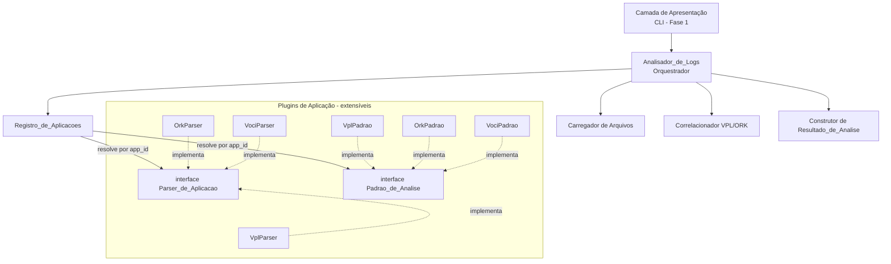
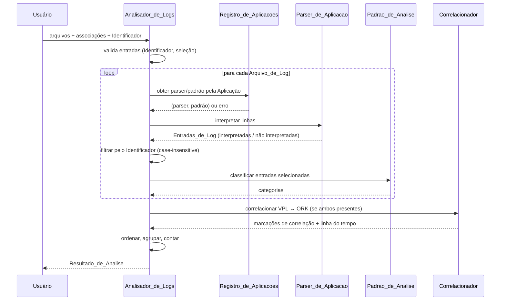

# Design Document

## Overview

O **Analisador_de_Logs** é uma ferramenta, escrita em Python, que carrega múltiplos
Arquivos_de_Log de Aplicações distintas, filtra Entradas_de_Log por um Identificador fornecido
pelo usuário, interpreta cada entrada conforme o Parser_de_Aplicacao da Aplicação associada,
classifica as entradas conforme o Padrao_de_Analise da Aplicação e apresenta um
Resultado_de_Analise estruturado. Quando há logs de ORK e VPL para o mesmo Identificador, as
entradas são correlacionadas em uma linha do tempo única.

Esta é a **Fase 1 (estrutura)**. O foco do design é estabelecer uma arquitetura extensível em
estilo *plugin*: interfaces comuns para `Parser_de_Aplicacao` e `Padrao_de_Analise`, mais um
`Registro_de_Aplicacoes` central que liga cada Aplicação ao seu par parser/padrão. Como os
formatos detalhados de log ainda não são conhecidos, os Padrões de Análise da Fase 1 classificam
toda entrada como "não classificada"; as regras reais de sucesso/erro serão fornecidas na Fase 2,
**sem alterar as Aplicações existentes nem o núcleo**.

### Objetivos de design

- **Extensibilidade aberta/fechada**: adicionar uma nova Aplicação significa criar um novo
  parser + padrão e registrá-los, sem tocar no código das Aplicações já suportadas (Req 7).
- **Interfaces comuns estáveis**: `Parser_de_Aplicacao` e `Padrao_de_Analise` são contratos
  abstratos. O núcleo só conhece esses contratos, nunca implementações concretas (Req 7.3, 7.4).
- **Robustez parcial**: um arquivo inválido nunca aborta a análise dos demais; erros são
  acumulados no Resultado_de_Analise (Req 1.2, 1.4, 1.5, 10.4, 10.5).
- **Determinismo**: ordenação por carimbo de tempo, com desempates determinísticos (Req 3.4,
  8.2).
- **Reversibilidade da interpretação (round-trip)**: interpretar → imprimir → interpretar
  preserva os campos estruturados (Req 4.5). Esta é a propriedade central verificável por testes
  baseados em propriedades.

### Decisões tecnológicas

| Decisão | Escolha | Justificativa |
|---------|---------|---------------|
| Linguagem | Python 3.11+ | Forte suporte a abstrações (ABCs), leitura eficiente de arquivos grandes, ecossistema de testes maduro. |
| Contratos de plugin | `abc.ABC` + `@abstractmethod` | Garante que parsers/padrões implementem a interface comum; permite a validação exigida pelo Req 7.5. |
| Leitura de arquivos | streaming linha a linha | Arquivos de até 500 MB (Req 1.1) exigem leitura incremental, evitando carregar tudo em memória. |
| Testes baseados em propriedades | [Hypothesis](https://hypothesis.readthedocs.io/) | Biblioteca padrão de PBT em Python; ideal para a propriedade de round-trip (Req 4.5). |
| Apresentação inicial | camada desacoplada (CLI na Fase 1) | A lógica de núcleo não depende da camada de apresentação, permitindo evoluir a UI depois. |

## Architecture

A arquitetura separa quatro camadas: **Apresentação**, **Orquestração (núcleo)**,
**Plugins de Aplicação** (parsers + padrões) e **Registro**. O núcleo depende apenas de
interfaces abstratas, nunca de implementações concretas das Aplicações.



### Fluxo principal de análise



### Pipeline de processamento por entrada

1. **Carregar** o Arquivo_de_Log (validar legibilidade, tamanho ≤ 500 MB, não vazio).
2. **Resolver** parser e padrão via Registro_de_Aplicacoes pela Aplicação associada.
3. **Interpretar** cada linha → `EntradaDeLog` estruturada ou marcada como *não interpretada*
   (texto original preservado).
4. **Filtrar** pelas entradas cujo conteúdo corresponde ao Identificador (sem diferenciar
   maiúsculas/minúsculas).
5. **Classificar** cada entrada selecionada aplicando o Padrao_de_Analise (primeira regra
   correspondente; "não classificada" se nenhuma).
6. **Correlacionar** VPL e ORK quando ambos estiverem presentes.
7. **Compor** o Resultado_de_Analise: agrupar por Aplicação, ordenar por tempo, contar por
   categoria e por Aplicação.

## Components and Interfaces

### Interface comum: `Parser_de_Aplicacao`

Contrato abstrato que toda Aplicação deve implementar para interpretar e imprimir suas
Entradas_de_Log. Sustenta a extensibilidade (Req 7.3) e a propriedade de round-trip (Req 4.5).

```python
from abc import ABC, abstractmethod
from typing import Iterable

class Parser_de_Aplicacao(ABC):
    @property
    @abstractmethod
    def niveis_de_severidade(self) -> frozenset[str]:
        """Conjunto de níveis de severidade válidos definidos pela Aplicação."""

    @abstractmethod
    def interpretar_entrada(self, texto: str) -> "EntradaDeLog":
        """Converte uma linha bruta em EntradaDeLog estruturada.
        Se faltar carimbo de tempo válido, severidade válida ou mensagem,
        retorna uma EntradaDeLog marcada como nao_interpretada, preservando o texto original.
        (Req 4.1, 4.2, 4.3)"""

    @abstractmethod
    def imprimir_entrada(self, entrada: "EntradaDeLog") -> str:
        """Produz a representação textual contendo carimbo de tempo, severidade e mensagem.
        (Req 4.4) — deve satisfazer o round-trip do Req 4.5 para entradas interpretadas."""

    def interpretar_arquivo(self, linhas: Iterable[str]) -> list["EntradaDeLog"]:
        """Interpretação em streaming, linha a linha (default fornecido pela classe base)."""
        return [self.interpretar_entrada(l) for l in linhas]
```

### Interface comum: `Padrao_de_Analise`

Contrato abstrato que classifica Entradas_de_Log conforme a semântica da Aplicação (Req 7.4).

```python
class Padrao_de_Analise(ABC):
    @property
    @abstractmethod
    def categorias(self) -> tuple["Categoria", ...]:
        """Categorias suportadas; DEVE incluir no mínimo SUCESSO e ERRO (Req 5.3)."""

    @abstractmethod
    def classificar(self, entrada: "EntradaDeLog") -> "Categoria":
        """Aplica as regras na ordem definida; retorna a categoria da primeira regra
        correspondente, ou NAO_CLASSIFICADA se nenhuma regra casar (Req 5.4, 5.5).
        Na Fase 1, sempre retorna NAO_CLASSIFICADA (Req 6.6)."""
```

### `Registro_de_Aplicacoes`

Catálogo central que associa cada `app_id` a um par `(Parser_de_Aplicacao, Padrao_de_Analise)`.
É o ponto de extensão do sistema.

```python
class Registro_de_Aplicacoes:
    def registrar(self, app_id: str, parser: Parser_de_Aplicacao,
                  padrao: Padrao_de_Analise) -> None:
        """Registra uma Aplicação. Valida:
        - app_id único (Req 7.6) — rejeita duplicado preservando o existente
        - parser implementa Parser_de_Aplicacao (Req 7.5)
        - padrao implementa Padrao_de_Analise (Req 7.5)
        Em falha, levanta ErroDeRegistro indicando a interface/causa e NÃO altera o catálogo."""

    def obter(self, app_id: str) -> tuple[Parser_de_Aplicacao, Padrao_de_Analise]:
        """Resolve o par parser/padrão; levanta AplicacaoNaoSuportada se ausente
        (Req 1.5, 2.2, 6.8)."""

    def aplicacoes_suportadas(self) -> tuple[str, ...]:
        """Lista os app_ids registrados."""

    def esta_registrada(self, app_id: str) -> bool: ...
```

**Inicialização (Req 6.1)**: na primeira execução o registro contém exatamente VPL, ORK e VOCI,
cada um com seu parser e seu padrão. A montagem ocorre em uma função de *bootstrap* dedicada,
isolada do núcleo, para que novas Aplicações sejam adicionadas só ali (princípio aberto/fechado).

### `Analisador_de_Logs` (orquestrador)

Coordena o fluxo. Não conhece Aplicações concretas — só o Registro e as interfaces.

```python
class Analisador_de_Logs:
    def __init__(self, registro: Registro_de_Aplicacoes): ...

    def analisar(self, selecao: list["ArquivoSelecionado"],
                 identificador: str) -> "ResultadoDeAnalise":
        """Valida entradas, carrega/interpreta/filtra/classifica/correlaciona e
        compõe o Resultado_de_Analise. Acumula erros sem abortar (Req 1.2, 10.x)."""
```

### `Correlacionador` (VPL ↔ ORK)

Recebe as Entradas_de_Log já interpretadas e filtradas de VPL e ORK e produz a linha do tempo
unificada, marcando como correlacionadas as entradas que compartilham o Identificador (Req 8).

### Camada de apresentação (CLI — Fase 1)

Consome o `ResultadoDeAnalise` e o renderiza: agrupamento por Aplicação, linha do tempo, marcação
visual distinta para categoria de erro (Req 9.3), e contagens (Req 9.4). É deliberadamente fina e
desacoplada, para que a lógica de núcleo permaneça testável e a UI possa evoluir na Fase 2.

### Mapa de responsabilidades

| Componente | Requisitos atendidos |
|-----------|----------------------|
| Carregador de Arquivos | 1.1, 1.2, 1.4, 10.4, 10.5 |
| Registro_de_Aplicacoes | 1.3, 1.5, 2.2, 5.1, 6.1–6.5, 6.8, 7.1–7.6 |
| Parser_de_Aplicacao (interface + impls) | 4.1–4.5, 6.2–6.4, 6.7 |
| Padrao_de_Analise (interface + impls) | 5.2–5.6, 6.6 |
| Analisador_de_Logs (orquestrador) | 2.x, 3.x, 10.x |
| Correlacionador | 8.1–8.5 |
| Camada de apresentação | 9.1–9.5 |

## Data Models

```python
from dataclasses import dataclass, field
from enum import Enum
from datetime import datetime

class Categoria(Enum):
    SUCESSO = "sucesso"
    ERRO = "erro"
    NAO_CLASSIFICADA = "não classificada"  # Req 5.4, 6.6

@dataclass(frozen=True)
class EntradaDeLog:
    texto_original: str            # sempre preservado (Req 4.3, 5.4, 6.7)
    aplicacao: str                 # app_id de origem
    ordem_de_leitura: int          # índice 0-based no arquivo; desempate (Req 3.4, 8.2)
    interpretada: bool             # False => não interpretada (Req 4.2)
    carimbo_de_tempo: datetime | None = None   # obrigatório se interpretada (Req 4.1)
    nivel_de_severidade: str | None = None     # obrigatório se interpretada (Req 4.1)
    mensagem: str | None = None                # obrigatório se interpretada (Req 4.1)
    categoria: Categoria = Categoria.NAO_CLASSIFICADA
    correlacionada: bool = False               # Req 8.3

@dataclass
class ArquivoSelecionado:
    caminho: str
    app_id: str | None             # None => Aplicação não informada (Req 2.3)

@dataclass
class MensagemDeErro:
    arquivo_ou_app: str            # identifica o Arquivo_de_Log/Aplicação afetado
    descricao: str

@dataclass
class ResultadoDeAnalise:
    identificador: str
    entradas_por_aplicacao: dict[str, list[EntradaDeLog]] = field(default_factory=dict)  # Req 3.3
    linha_do_tempo: list[EntradaDeLog] = field(default_factory=list)  # ordenada (Req 3.4, 8.1)
    contagem_por_categoria: dict[Categoria, int] = field(default_factory=dict)  # Req 9.4
    contagem_por_aplicacao: dict[str, int] = field(default_factory=dict)        # Req 9.4
    correlacao_encontrada: bool = False   # Req 8.3, 8.4
    erros: list[MensagemDeErro] = field(default_factory=list)  # acumulados (Req 1.2, 5.6, 8.5)
    mensagens: list[str] = field(default_factory=list)  # avisos (vazio, sem correspondência etc.)
```

### Invariantes dos dados

- **INV-1**: se `entrada.interpretada` é `True`, então `carimbo_de_tempo`, `nivel_de_severidade`
  e `mensagem` são todos não nulos/não vazios (Req 4.1).
- **INV-2**: `texto_original` nunca é descartado nem alterado, independentemente do estado de
  interpretação ou classificação (Req 4.3, 5.4, 6.7, 8.4).
- **INV-3**: `nivel_de_severidade` de uma entrada interpretada pertence a
  `parser.niveis_de_severidade` (Req 4.2).
- **INV-4**: `linha_do_tempo` está ordenada por `carimbo_de_tempo` crescente; empates resolvidos
  por nome da Aplicação (alfabético) e depois por `ordem_de_leitura` (Req 3.4, 8.2).

### Regras de ordenação determinística (Req 3.4, 8.2)

A chave de ordenação total da linha do tempo é a tupla:

```
(carimbo_de_tempo, nome_da_aplicacao, ordem_de_leitura)
```

Isso garante ordem crescente por tempo, com desempate alfabético por Aplicação e, por fim, pela
ordem original de leitura — produzindo um resultado totalmente determinístico.

## Correctness Properties

*Uma propriedade é uma característica ou comportamento que deve ser verdadeiro em todas as
execuções válidas de um sistema — essencialmente, uma afirmação formal sobre o que o sistema
deve fazer. As propriedades servem de ponte entre especificações legíveis por humanos e
garantias de correção verificáveis por máquina.*

As propriedades abaixo foram derivadas do pré-trabalho de análise dos critérios de aceitação.
Critérios redundantes foram consolidados (ver "Property Reflection"): ordenação (3.4/8.1/8.2),
robustez (1.2/1.5/10.4/10.5), roteamento (1.3/5.2), validação de identificador
(3.5/10.2/10.3) e preservação do registro (7.1/7.2 e 7.5/7.6/6.8/2.2). Como esta é a Fase 1,
a classificação sempre resulta em "não classificada"; a estrutura, porém, já é exercitada.

### Property 1: Round-trip de interpretação preserva os campos

*Para toda* Entrada_de_Log que um Parser_de_Aplicacao interpreta com sucesso (`interpretada =
True`), executar a sequência interpretar → imprimir → interpretar novamente produz uma
Entrada_de_Log cujos campos `carimbo_de_tempo`, `nivel_de_severidade` e `mensagem` são idênticos,
campo a campo, aos da primeira interpretação.

**Validates: Requirements 4.4, 4.5**

### Property 2: Corretude da interpretação (campos completos ⇔ interpretada)

*Para toda* linha bruta de uma Aplicação, o Parser_de_Aplicacao marca a entrada como
`interpretada = True` se e somente se ela possui carimbo de tempo válido, nível de severidade
pertencente a `niveis_de_severidade` e mensagem não vazia; quando interpretada, nenhum desses
três campos é nulo ou vazio.

**Validates: Requirements 4.1, 4.2, 6.7**

### Property 3: Preservação do texto original

*Para toda* linha bruta, qualquer que seja o resultado da interpretação ou da classificação, a
Entrada_de_Log resultante tem `texto_original` exatamente igual à linha de entrada, sem descarte
nem alteração.

**Validates: Requirements 4.3, 5.4, 6.7, 8.4**

### Property 4: Filtragem por Identificador é correta e completa

*Para todo* conjunto de Entradas_de_Log e Identificador válido, o conjunto selecionado contém
exatamente as entradas cujo conteúdo corresponde ao Identificador sem diferenciar maiúsculas de
minúsculas — toda entrada correspondente é incluída e nenhuma entrada não correspondente é
incluída.

**Validates: Requirements 3.1, 3.2**

### Property 5: Ordenação determinística da linha do tempo

*Para todo* conjunto de Entradas_de_Log interpretadas (incluindo a fusão de VPL e ORK), a
`linha_do_tempo` resultante está ordenada de forma total e determinística pela chave
`(carimbo_de_tempo, nome_da_aplicacao, ordem_de_leitura)`, ou seja, por tempo crescente, com
empates resolvidos pelo nome da Aplicação em ordem alfabética e, então, pela ordem de leitura.

**Validates: Requirements 3.4, 8.1, 8.2**

### Property 6: Agrupamento por Aplicação

*Para todo* Resultado_de_Analise, as Entradas_de_Log estão particionadas por Aplicação: cada
grupo contém somente entradas da Aplicação correspondente e a união disjunta dos grupos é igual
ao conjunto total de entradas selecionadas.

**Validates: Requirements 3.3**

### Property 7: Roteamento parser/padrão pela Aplicação associada

*Para todo* conjunto de Arquivos_de_Log com Aplicações associadas variadas, cada Arquivo_de_Log
é interpretado pelo Parser_de_Aplicacao e classificado pelo Padrao_de_Analise registrados para a
sua Aplicação no Registro_de_Aplicacoes.

**Validates: Requirements 1.3, 5.2**

### Property 8: Robustez — entradas inválidas não impedem o processamento das válidas

*Para toda* seleção mista de Arquivos_de_Log (válidos e inválidos: ilegíveis, vazios, acima de
500 MB, sem Aplicação associada ou em formato não reconhecido), o Analisador_de_Logs processa
integralmente os arquivos válidos e acumula em `erros` uma indicação para cada arquivo inválido
identificando o Arquivo_de_Log afetado, sem abortar a análise.

**Validates: Requirements 1.2, 1.4, 1.5, 10.4, 10.5**

### Property 9: Validação do Identificador rejeita e preserva o estado

*Para toda* string de Identificador inválida (vazia, composta apenas por espaços em branco, ou
com mais de 256 caracteres), o Analisador_de_Logs rejeita a busca, preserva inalterados o
Resultado_de_Analise anterior e os Arquivos_de_Log já selecionados, e produz uma mensagem de
Identificador inválido.

**Validates: Requirements 3.5, 10.2, 10.3**

### Property 10: Classificação na Fase 1 é uma categoria válida e "não classificada"

*Para toda* Entrada_de_Log de qualquer Aplicação inicial (VPL, ORK, VOCI), o Padrao_de_Analise
retorna exatamente uma categoria pertencente ao seu conjunto `categorias` e, na Fase 1, essa
categoria é sempre `NAO_CLASSIFICADA`.

**Validates: Requirements 5.3, 5.4, 6.6**

### Property 11: Reassociação faz a última Aplicação prevalecer

*Para toda* sequência de associações aplicadas a um mesmo Arquivo_de_Log com Aplicações válidas,
a Aplicação efetivamente atribuída ao final é a última informada na sequência.

**Validates: Requirements 2.5**

### Property 12: Registro/associação inválida não altera o estado

*Para todo* Registro_de_Aplicacoes e toda tentativa de registro inválida — parser ou padrão que
não implementa a interface comum, Identificador de Aplicação duplicado, ou associação a uma
Aplicação não registrada — o registro é rejeitado, o conjunto de Aplicações reconhecidas
permanece inalterado e é produzida uma indicação de erro identificando a causa (interface não
implementada, identificador duplicado ou aplicação não suportada).

**Validates: Requirements 2.2, 6.8, 7.5, 7.6**

### Property 13: Extensibilidade preserva as Aplicações existentes

*Para todo* Registro_de_Aplicacoes e toda nova Aplicação válida com Identificador inédito (parser
e padrão implementando as interfaces comuns), após o registro a nova Aplicação passa a ser
reconhecida e disponível para seleção, enquanto os pares parser/padrão de todas as Aplicações
previamente registradas permanecem idênticos.

**Validates: Requirements 7.1, 7.2**

### Property 14: Correlação VPL ↔ ORK marca exatamente os Identificadores compartilhados

*Para todo* conjunto de Entradas_de_Log de VPL e ORK, uma entrada é marcada como
`correlacionada = True` se e somente se existe uma entrada da outra Aplicação que compartilha o
mesmo Identificador; quando nenhum Identificador é compartilhado, `correlacao_encontrada` é
`False` e todas as entradas são preservadas sem alteração.

**Validates: Requirements 8.3, 8.4**

### Property 15: Integridade das contagens do Resultado_de_Analise

*Para todo* Resultado_de_Analise, a soma das contagens em `contagem_por_categoria` é igual ao
total de Entradas_de_Log selecionadas, a soma das contagens em `contagem_por_aplicacao` também
é igual a esse total, e cada contagem corresponde exatamente ao número real de entradas daquela
categoria/Aplicação.

**Validates: Requirements 9.4**

### Property 16: Completude dos atributos apresentados por entrada

*Para todo* Resultado_de_Analise não vazio, cada Entrada_de_Log apresentada inclui o seu
conteúdo, a Aplicação de origem e a categoria atribuída.

**Validates: Requirements 9.1**

## Error Handling

A estratégia de tratamento de erros é **acumulativa e não destrutiva**: falhas em itens
individuais nunca abortam a operação global. Erros são coletados em
`ResultadoDeAnalise.erros` (cada um identificando o Arquivo_de_Log ou a Aplicação afetada) e
avisos informativos em `ResultadoDeAnalise.mensagens`.

| Situação | Requisito | Tratamento |
|----------|-----------|------------|
| Arquivo ilegível ou vazio | 1.2, 10.4 | Erro identificando o arquivo; demais preservados; análise continua. |
| Arquivo > 500 MB | 1.4 | Arquivo rejeitado com erro identificando-o; demais continuam. |
| Arquivo sem Aplicação associada | 1.5 | Erro identificando o arquivo; demais continuam. |
| Formato não reconhecido pelo parser | 10.5 | Erro de "formato inválido" identificando o arquivo; seleção dos demais preservada. |
| Aplicação não registrada (associação/análise) | 2.2, 6.8 | Rejeição com erro "Aplicação não suportada"; arquivo permanece sem Aplicação. |
| Aplicação não informada | 2.3, 2.4 | Bloqueia a análise daquele arquivo e solicita identificação; expira em 60 s. |
| Identificador inválido (vazio/whitespace/>256) | 3.5, 10.2, 10.3 | Busca rejeitada; estado preservado; mensagem de Identificador inválido. |
| Nenhuma correspondência | 3.2, 9.2 | Resultado vazio + mensagem informativa. |
| Nenhum arquivo carregado | 3.6, 10.1 | Resultado vazio + mensagem; Identificador preservado. |
| App sem Padrao_de_Analise | 5.6 | Indicação de erro no resultado identificando a Aplicação. |
| Registro com interface não implementada | 7.5 | `ErroDeRegistro` indicando a interface; catálogo inalterado. |
| Identificador de Aplicação duplicado | 7.6 | `ErroDeRegistro` de id duplicado; Aplicação existente preservada. |
| Lado da correlação indisponível | 8.5 | Erro identificando a Aplicação; entradas da outra Aplicação preservadas. |
| Falha ao apresentar o resultado | 9.5 | Mensagem de falha de exibição; entradas selecionadas preservadas. |

### Hierarquia de exceções

- `ErroDoAnalisador` (base)
  - `ErroDeRegistro` — interface não implementada, id duplicado, app não suportada (Req 7.5,
    7.6, 6.8, 2.2).
  - `ErroDeArquivo` — ilegível, vazio, grande demais, formato inválido (Req 1.2, 1.4, 10.5).
  - `ErroDeIdentificador` — inválido (Req 3.5, 10.2, 10.3).

Erros de validação e de itens individuais são **capturados pelo orquestrador** e convertidos em
`MensagemDeErro` no resultado; apenas erros de programação (bugs) propagam.

## Testing Strategy

A estratégia combina **testes baseados em propriedades** (PBT) para a lógica de núcleo e
**testes de exemplo/integração** para casos específicos, de configuração e de fluxo.

### Por que PBT se aplica aqui

O núcleo é composto por funções com entrada/saída bem definidas: parsers (interpretar/imprimir),
filtro por Identificador, ordenação, classificação, correlação e composição de contagens. Há
propriedades universais claras — com destaque para o **round-trip de parser** explicitamente
exigido pelo Req 4.5. Esses elementos são o caso ideal para PBT.

### Biblioteca e configuração

- **Biblioteca**: [Hypothesis](https://hypothesis.readthedocs.io/) (PBT padrão em Python). Não
  implementar PBT do zero.
- **Iterações**: mínimo de **100 iterações** por teste de propriedade
  (`@settings(max_examples=100)`).
- **Geradores (`strategies`)**: estratégias dedicadas para linhas de log válidas e malformadas
  por Aplicação, timestamps (inclusive repetidos), níveis de severidade dentro/fora do conjunto,
  Identificadores válidos/inválidos (vazios, whitespace, > 256), conjuntos mistos de arquivos e
  registros de Aplicações. Os geradores devem cobrir os casos de borda (EDGE_CASE): tamanho em
  torno de 500 MB (simulado por metadado, sem alocar 500 MB reais), conteúdo não-HTML/ruído,
  caracteres especiais/Unicode e listas vazias.
- **Rastreabilidade**: cada teste de propriedade leva um comentário com a tag
  **`Feature: log-analyzer, Property {n}: {texto da propriedade}`** referenciando a propriedade
  correspondente desta seção. Cada propriedade é implementada por **um único** teste baseado em
  propriedade.

### Mapeamento propriedade → teste

| Propriedade | Foco do teste |
|-------------|---------------|
| P1 Round-trip | `parse(print(parse(x)))` igual campo a campo para entradas interpretáveis. |
| P2 Interpretação | Bicondicional interpretada ⇔ campos completos/válidos. |
| P3 Preservação de texto | `texto_original == linha` para qualquer linha. |
| P4 Filtro | Seleção correta e completa, case-insensitive. |
| P5 Ordenação | Chave total `(tempo, app, ordem_de_leitura)`. |
| P6 Agrupamento | Partição disjunta por Aplicação. |
| P7 Roteamento | Parser/padrão corretos por Aplicação. |
| P8 Robustez | Válidos processados, erro por inválido, sem abortar. |
| P9 Validação de id | Rejeição + preservação do estado. |
| P10 Classificação Fase 1 | Categoria válida e sempre `NAO_CLASSIFICADA`. |
| P11 Reassociação | Última Aplicação prevalece. |
| P12 Registro inválido | Rejeição + estado inalterado + erro com causa. |
| P13 Extensibilidade | Nova app reconhecida; existentes inalteradas. |
| P14 Correlação | Marcação ⇔ Identificador compartilhado. |
| P15 Contagens | Somas e contagens consistentes. |
| P16 Atributos | Conteúdo + Aplicação + categoria por entrada. |

### Testes de exemplo e integração (não-PBT)

- **Configuração/bootstrap (EXAMPLE/SMOKE)**: registro inicial contém exatamente VPL, ORK e VOCI
  com ids únicos e um parser+padrão cada (Req 6.1–6.5); interfaces comuns definidas e implementadas
  pelas classes iniciais (Req 7.3, 7.4).
- **Fluxo/edge (EDGE_CASE/EXAMPLE)**: nenhuma correspondência (3.2/9.2), nenhum arquivo carregado
  (3.6/10.1), Aplicação não informada e timeout de 60 s (2.3/2.4), marcação visual de erro na
  renderização (9.3), falha de apresentação (9.5), lado da correlação indisponível (8.5),
  carga de poucos arquivos (1.1) e tamanho no limite de 500 MB (1.4).
- **Desempenho/UI (fora de teste automatizado de correção)**: confirmação em ≤ 2 s (2.1) e
  exibição de erro em ≤ 2 s (10.6) são metas de desempenho/UX; serão verificadas por medição
  manual/observabilidade, não por PBT.

### Cobertura de Fase 2

Quando a Fase 2 fornecer logs reais com causa-raiz conhecida, os Padrões de Análise ganharão
regras de sucesso/erro. As propriedades P5.5 (prioridade da primeira regra) e a classificação em
categorias reais serão então exercitadas, sem alterar as interfaces comuns nem o núcleo — apenas
adicionando/ajustando as regras dentro de cada `Padrao_de_Analise`.
